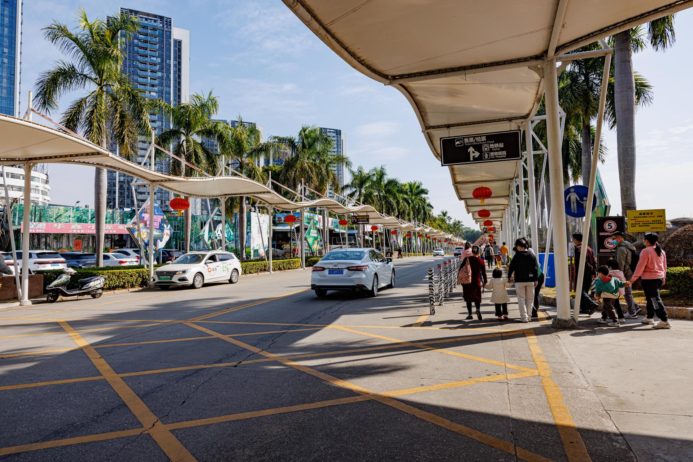

# 深圳野生动物园

## 景点图片

> 图片来源：[Wikimedia Commons](https://commons.wikimedia.org/wiki/File%3ASHENZHEN_SAFARI_PARK_%284%29.jpg) · 许可证：CC BY-SA 4.0

## 基本信息

| 项目 | 内容 |
|------|------|
| 景点名称 | 深圳野生动物园 |
| 所在城市 | 深圳市 |
| 所在区县 | 南山区 |
| 景点级别 | 4A级景区 |
| 景点类型 | 动物园 |
| 开放时间 | 09:00-18:00 |
| 门票价格 | 约240元/人 |

## 景点介绍

深圳野生动物园位于深圳市南山区，是中国第一家放养式野生动物园，也是国家AAAA级旅游景区。动物园占地面积约60万平方米，拥有各种珍稀动物300多种、10000多只。

深圳野生动物园采用放养式的展览方式，动物在相对自然的环境中生活。园区分为乘车游览区和步行游览区两大区域。乘车游览区可乘坐小火车穿越猛兽区，近距离观赏老虎、狮子、熊等动物。步行游览区有大熊猫馆、金丝猴馆、长颈鹿馆、海豚表演馆等。

深圳野生动物园是深圳市最受欢迎的主题公园之一，也是珠三角地区游客亲子游的热门去处。

## 景点特点

- **中国第一家放养式野生动物园**：采用放养式展览方式
- **300多种珍稀动物**：大熊猫、金丝猴、海豚等
- **乘车游览区**：乘坐小火车穿越猛兽区
- **海豚表演**：精彩的海豚表演
- **亲子首选**：深圳市最受欢迎的动物园

## 位置

- **地址**：深圳市南山区西丽湖路4086号
- **经纬度**：22.5933°N, 113.9624°E

## 交通

- **地铁**：7号线西丽湖站
- **公交**：多路公交至动物园站
- **自驾**：可停放至动物园停车场

## 数据来源

- [深圳野生动物园官方网站](http://www.szzoo.net/)
- [百度百科-深圳野生动物园](https://baike.baidu.com/item/深圳野生动物园)

## 最后更新时间

2026-06-20
