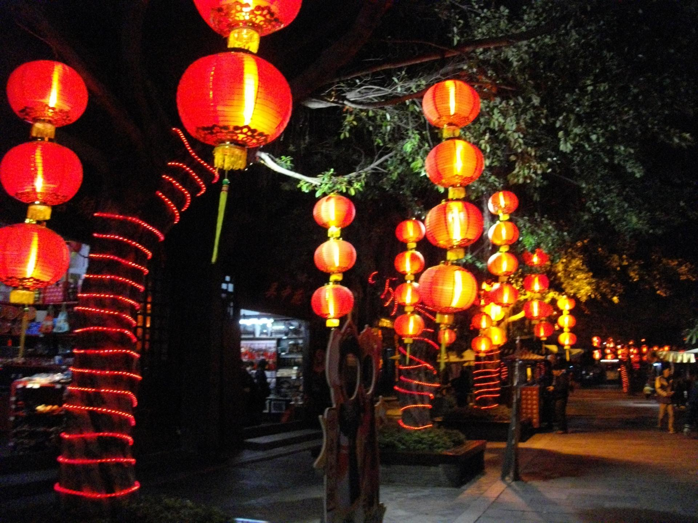

# 锦绣中华民俗村

## 景点图片

> 图片来源：[Wikimedia Commons](https://commons.wikimedia.org/wiki/File:Night_at_Splendid_China_Folk_Village_02.JPG) · 许可证：CC BY-SA 4.0

## 基本信息

| 项目 | 内容 |
|------|------|
| 景点名称 | 锦绣中华民俗村 |
| 所在城市 | 深圳市 |
| 所在区县 | 南山区 |
| 景点级别 | 4A级景区（华侨城旅游度假区组成部分） |
| 景点类型 | 主题公园 |
| 开放时间 | 09:00-21:00（全年开放，具体以景区公告为准） |
| 门票价格 | 待确认 |

## 景点介绍

锦绣中华民俗村位于广东省深圳市南山区华侨城，占地面积约30万平方米，是华侨城旅游度假区的重要组成部分。景区分为锦绣中华微缩景区和中国民俗文化村两大部分，是中国最早的主题公园之一。

锦绣中华微缩景区按中国版图位置分布，展示了中国近百处名胜古迹的微缩景观，包括万里长城、秦陵兵马俑、故宫、敦煌莫高窟等，让游客在一天之内领略中华五千年文明的壮丽画卷。中国民俗文化村则展示了中国各民族的建筑风格、民俗风情和传统文化，村内有24个民族的27个村寨，游客可以观赏民族歌舞表演，体验各民族的传统习俗和手工艺。

## 景点特点

- **微缩景观**：锦绣中华微缩景区浓缩了中国近百处名胜古迹，规模宏大、制作精良
- **民族文化**：中国民俗文化村汇集24个民族的村寨，展示多元的民族风情
- **歌舞表演**：每天上演多场大型民族歌舞表演，精彩纷呈
- **历史文化**：景区承载着丰富的中华历史文化内涵，是爱国主义教育基地
- **互动体验**：游客可参与民俗手工艺制作、民族服饰体验等互动活动
- **华侨城核心**：作为华侨城旅游度假区的核心景区，周边配套完善

## 位置

- **地址**：广东省深圳市南山区深南大道9003号锦绣中华民俗村
- **经纬度**：22.5380°N, 113.9820°E

## 交通

- **地铁**：深圳地铁1号线（罗宝线）华侨城站D出口，步行约5分钟
- **公交**：乘坐M486路、M487路、M520路等至锦绣中华站
- **自驾**：经深南大道或滨海大道至华侨城片区，景区设有停车场

## 数据来源

- [深圳市文化广电旅游体育局](http://wtl.sz.gov.cn/)

## 最后更新时间

2026-06-25
