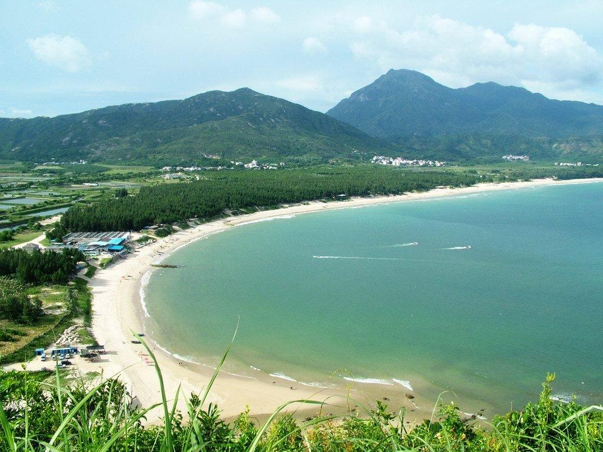

# 东西涌

## 景点图片

## 基本信息

| 项目 | 内容 |
|------|------|
| 景点名称 | 东西涌 |
| 所在城市 | 深圳市 |
| 所在区县 | 大鹏新区 |
| 景点级别 | - |
| 景点类型 | 自然风光 / 徒步路线 |
| 开放时间 | 全天开放（建议白天游览） |
| 门票价格 | 穿越路线免费；东涌/西涌沙滩卫生管理费约10元/人 |

## 景点介绍

东西涌位于深圳市大鹏新区南澳街道，由东涌和西涌两个海滩组成，中间通过一条长约12公里的海岸线相连。东西涌穿越是华南地区最经典的徒步路线之一，被誉为"中国最美八大海岸线"之一。

东涌沙滩绵延数公里，沙质细腻，海水清澈，是深圳最大的天然海滩之一。西涌则拥有深圳最长的海岸线和最多的日出观测点，也是深圳最佳的日出观赏地点。

穿越路线沿途经过海岸线、悬崖、礁石、渔村等自然景观，风景壮丽，是户外爱好者和摄影爱好者的天堂。整条路线难度适中，适合有一定体力的徒步者。

## 景点特点

- 华南地区最经典的徒步路线之一，全长约12公里
- 沿途经过海岸线、悬崖、礁石、渔村等多样自然景观
- 东涌沙滩是深圳最大的天然海滩之一，沙质细腻
- 西涌拥有深圳最长的海岸线，是最佳日出观赏地点
- 适合摄影、户外探险和海滨休闲
- 与杨梅坑、较场尾、大鹏天文台等景点相邻，可组合游览

## 位置

- **地址**：大鹏新区南澳街道（东涌社区 / 西涌社区）
- **经纬度**：东涌 22.5450, 114.5850 / 西涌 22.5380, 114.5720

## 交通

- **地铁**：乘坐地铁8号线至小梅沙站，换乘公交M436路至"东涌"站或"西涌"站下车
- **公交**：M436路、E11路等线路可达大鹏/南澳方向
- **自驾**：导航至"东涌沙滩"或"西涌度假村"，从深圳市区出发约1.5-2小时车程（周末及节假日大鹏新区需提前预约通行）

## 注意事项

- 建议白天进行穿越，避免夜间徒步
- 最佳季节为春秋两季（3-5月、9-11月）
- 夏季需注意防暑防蚊，冬季海风较大
- 周末及节假日前往大鹏新区需通过"深圳交警"公众号预约通行
- 穿越路线需一定体力，建议携带足够的水和食物
- 请爱护环境，带走所有垃圾

## 数据来源

- [马蜂窝 - 大鹏半岛旅游攻略](https://www.mafengwo.cn/gonglve/mdd/20004693.html)
- [携程旅行](https://you.ctrip.com/)

## 最后更新时间

2026-07-11
