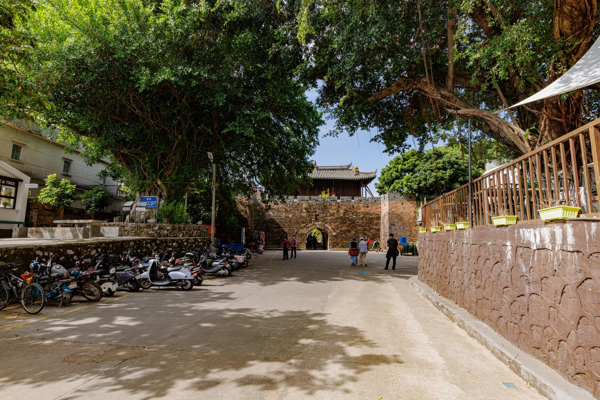

# 大鹏所城

## 景点图片

> 图片来源：[Wikimedia Commons](https://commons.wikimedia.org/wiki/File:Dapeng_Fortress,_Shenzhen.jpg) · 许可证：CC BY-SA 4.0

## 基本信息

| 项目 | 内容 |
|------|------|
| 景点名称 | 大鹏所城 |
| 所在城市 | 深圳市 |
| 所在区县 | 大鹏新区 |
| 景点级别 | - |
| 景点类型 | 历史遗址 |
| 开放时间 | 09:00-18:00（周一至周日） |
| 门票价格 | 免费 |

## 景点介绍

大鹏所城位于深圳市大鹏新区鹏城社区，始建于明洪武二十七年（1394年），是明清两代中国南方海防军事要塞，至今已有600多年历史。2001年被国务院公布为全国重点文物保护单位，是深圳"鹏城"别称的由来之地。

大鹏所城占地面积约11万平方米，城内保存有较完整的明清建筑格局，包括城门、城墙、古街巷、将军府第、民居等。古城内的主要景点有大鹏所城城墙、赖恩爵将军府、刘起龙将军府、大鹏古城博物馆等。城内青石板路纵横交错，古朴的岭南建筑错落有致，是深圳最具历史文化底蕴的古村落之一。

大鹏所城见证了深圳地区的海防历史和抗击外来侵略的英勇事迹。清代名将赖恩爵曾在此镇守海疆，大鹏所城在鸦片战争中发挥了重要的军事作用。如今的古城已成为深圳重要的历史文化景区和爱国主义教育基地。

## 景点特点

- 始建于1394年，有600多年历史，全国重点文物保护单位
- 保存较完整的明清建筑格局，包括城墙、古街巷和将军府第
- 深圳"鹏城"别称的由来之地
- 见证了中国南方海防历史和抗击外来侵略的英勇事迹

## 位置

- **地址**：大鹏新区鹏城社区
- **经纬度**：22.5567°N, 114.541°E## 交通

- **地铁**：暂无地铁直达
- **公交**：可乘坐E11路、M362路等公交车至大鹏所城站下车
- **自驾**：导航至"大鹏所城"，古城周边设有停车场

## 数据来源

- [深圳市文物局](https://www.szwb.sz.gov.cn/)

## 最后更新时间

2026-06-20
