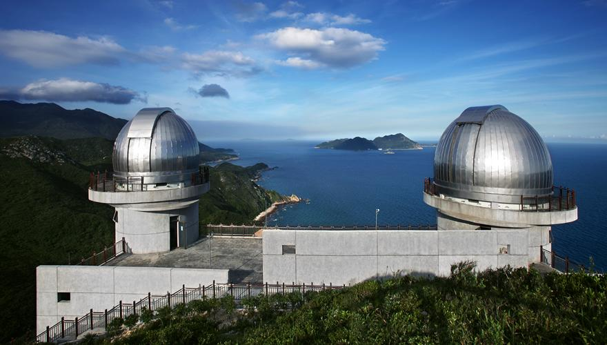

# 深圳天文台

## 景点图片

## 基本信息

| 项目 | 内容 |
|------|------|
| 景点名称 | 深圳天文台 |
| 所在城市 | 深圳市 |
| 所在区县 | 大鹏新区 |
| 景点级别 | - |
| 景点类型 | 科技科普 / 自然风光 |
| 开放时间 | 9:00-17:00（16:30停止入园）；周一闭馆（法定节假日除外） |
| 门票价格 | 免费（需提前预约） |

## 景点介绍

深圳天文台位于深圳市大鹏新区南澳街道新大社区较场尾村附近，地处大鹏半岛最南端，依山傍海，是中国首个建在海边的天文台。

天文台拥有先进的天文观测设备和科普展厅，游客可以参观天文望远镜、了解天文知识，并在观景平台上欣赏壮丽的海景和日落。这里还是深圳最受欢迎的观星和日落观赏地点之一。

天文台附近就是著名的鹿嘴山庄——周星驰电影《美人鱼》的主要取景地，山清水秀，悬崖峭壁与碧海蓝天相映成趣。从天文台步行至鹿嘴山庄的沿海步道风景优美，是徒步和摄影爱好者的热门路线。

## 景点特点

- 中国首个建在海边的天文台，兼具科普与观光功能
- 依山傍海的独特地理位置，可欣赏壮丽的海景和日落
- 是深圳最受欢迎的观星地点之一，夜间观星活动需单独预约
- 毗邻鹿嘴山庄（《美人鱼》取景地），可组合游览
- 沿海步道风景优美，适合徒步和摄影
- 免费开放，需提前实名预约

## 位置

- **地址**：大鹏新区南澳街道新大社区较场尾村附近
- **经纬度**：22.4797°N, 114.5593°E

## 交通

- **地铁**：乘坐地铁8号线至盐田路站，换乘公交M438路或M471路至"天文台"站下车
- **公交**：M438路、M471路、M472路等线路可达
- **自驾**：导航至"深圳天文台"，停车场位于天文台入口处（车位有限，建议早到）

## 参观须知

- 需提前通过"深圳天文台"微信公众号实名预约
- 每日限流，建议提前3天预约
- 夜间观星活动需单独预约，具体时间根据天气和月相安排
- 天文台部分区域为科研重地，游客需遵守相关规定，不得进入限制区域
- 海边风大，建议携带防风外套
- 建议游览时长：2-3小时

## 数据来源

- [深圳市气象局（台） - 深圳市天文台](https://weather.sz.gov.cn/qixiangfuwu/kepufuwu/kepujidi/shenzhenshitianwentai)

## 最后更新时间

2026-07-11
