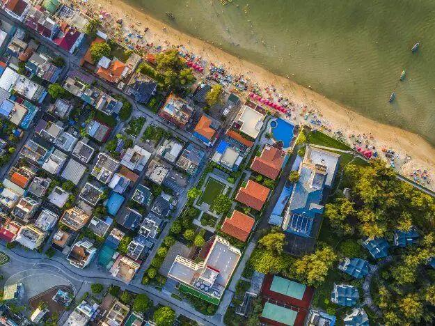

# 较场尾

## 景点图片

## 基本信息

| 项目 | 内容 |
|------|------|
| 景点名称 | 较场尾 |
| 所在城市 | 深圳市 |
| 所在区县 | 大鹏新区 |
| 景点级别 | - |
| 景点类型 | 滨海民宿村 / 海滩 |
| 开放时间 | 全天开放 |
| 门票价格 | 免费 |

## 景点介绍

较场尾位于深圳市大鹏新区南澳街道，紧邻杨梅坑和大鹏天文台，是深圳最受欢迎的滨海度假村落之一，被誉为"深圳小鼓浪屿"。

较场尾拥有深圳少有的原始沙滩，海岸线长约1公里，沙滩平缓，海水清澈。村内保留了大量传统岭南风格的民居建筑，近年来经过改造升级，汇聚了数十家风格各异的精品民宿、特色餐厅、咖啡馆和文创小店，形成了独具特色的滨海度假氛围。

较场尾是深圳短途度假和周末休闲的热门目的地，尤其适合家庭出游和朋友聚会。这里不仅可以享受海滩阳光，还可以徒步前往大鹏天文台、鹿嘴山庄等景点。

## 景点特点

- 被誉为"深圳小鼓浪屿"，拥有数十家精品民宿
- 原始沙滩海岸线长约1公里，沙滩平缓，海水清澈
- 传统岭南民居与现代化民宿完美融合
- 特色餐厅、咖啡馆和文创小店遍布村落
- 紧邻大鹏天文台和杨梅坑，可组合游览
- 适合短途度假、周末休闲和家庭出游

## 位置

- **地址**：大鹏新区南澳街道新大社区较场尾村
- **经纬度**：22.5882°N, 114.5097°E

## 交通

- **地铁**：乘坐地铁8号线至小梅沙站，换乘公交M438路至"较场尾"站下车
- **公交**：M438路、M471路、M472路等线路可达
- **自驾**：导航至"较场尾"，从深圳市区出发约1.5-2小时车程（周末及节假日大鹏新区需提前预约通行）

## 注意事项

- 周末及节假日前往大鹏新区需通过"深圳交警"公众号预约通行
- 建议提前预订民宿，旺季房源紧张
- 海边紫外线强烈，注意防晒

## 数据来源

- [百度百科-较场尾](https://baike.baidu.com/item/%E8%BE%83%E5%9C%BA%E5%B0%BE)

## 最后更新时间

2026-07-11
