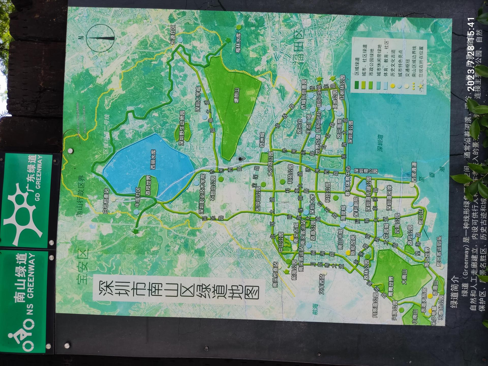

# 欢乐港湾

## 景点图片

> 图片来源：[Wikimedia Commons](https://commons.wikimedia.org/wiki/File:SZ_深圳_Shenzhen_福田_Futian_深南大道_Shennan_Road_map_sign_July_2023_Px3_03.jpg) · 许可证：CC BY-SA 4.0

## 基本信息

| 项目 | 内容 |
|------|------|
| 景点名称 | 欢乐港湾 |
| 所在城市 | 深圳市 |
| 所在区县 | 宝安区 |
| 景点级别 | 无 |
| 景点类型 | 综合性文旅项目 |
| 开放时间 | 全天开放（湾区之光摩天轮：10:00-22:00） |
| 门票价格 | 海滨文化公园免费；摩天轮约128元/人 |

## 景点介绍

欢乐港湾位于深圳市宝安区前海湾畔，是深圳华侨城集团打造的大型滨海文旅综合体，集文化、休闲、商业、旅游于一体，是深圳市的地标性项目。

欢乐港湾最著名的景点是"湾区之光"摩天轮，高约128米，是深圳市的标志性建筑之一。乘坐摩天轮可俯瞰前海湾和深圳城市风光。海滨文化公园拥有优美的滨海景观和亲水平台，是深圳市市民休闲散步的热门去处。

欢乐港湾还有大型商业综合体，汇聚了众多餐厅、咖啡馆和商店。每到夜晚，灯光璀璨，景色十分迷人。

## 景点特点

- **"湾区之光"摩天轮**：高约128米，深圳地标之一
- **海滨文化公园**：优美的滨海景观和亲水平台
- **商业综合体**：汇聚众多餐厅、咖啡馆和商店
- **夜景迷人**：夜晚灯光璀璨
- **免费开放**：海滨文化公园免费

## 位置

- **地址**：深圳市宝安区新安街道宝华路欢乐港湾
- **经纬度**：22.5500°N, 113.8833°E

## 交通

- **地铁**：5号线临海站
- **公交**：多路公交至欢乐港湾站
- **自驾**：可停放至欢乐港湾停车场

## 数据来源

- [百度百科-欢乐港湾](https://baike.baidu.com/item/欢乐港湾)

## 最后更新时间

2026-06-20
