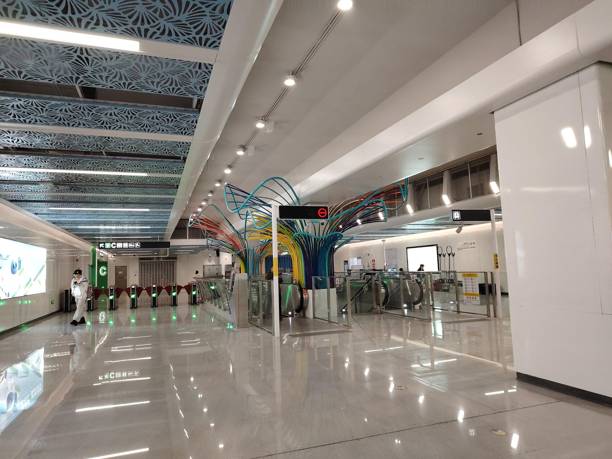

# 小梅沙

## 景点图片

> 图片来源：[Wikimedia Commons](https://commons.wikimedia.org/wiki/File:%E5%B0%8F%E6%A2%85%E6%B2%99%E7%AB%99%E5%8E%85.jpg) · 许可证：CC BY-SA 4.0

## 基本信息

| 项目 | 内容 |
|------|------|
| 景点名称 | 小梅沙海滨旅游区 |
| 所在城市 | 深圳市 |
| 所在区县 | 盐田区 |
| 景点级别 | 无 |
| 景点类型 | 海滨旅游区 |
| 开放时间 | 07:00-22:00 |
| 门票价格 | 约50元/人（价格可能有调整） |

## 景点介绍

小梅沙位于深圳市盐田区大鹏湾畔，是深圳最著名的海滨旅游区之一，被誉为"东方夏威夷"。小梅沙三面环山，一面临海，拥有长约1000米的月牙形沙滩，沙质细腻，海水清澈，是深圳最受欢迎的海滨浴场之一。

小梅沙海滨旅游区集海滨浴场、海洋世界、度假酒店于一体。小梅沙海洋世界是深圳最早的海洋主题乐园，拥有海豚表演、白鲸表演等精彩节目。度假区内还有烧烤区、拓展基地等设施，是深圳市民周末度假的热门去处。

近年来小梅沙片区进行了大规模的改造升级，打造"新小梅沙"项目，将进一步提升旅游品质和服务水平。

## 景点特点

- **"东方夏威夷"**：深圳最著名的海滨旅游区之一
- **月牙形沙滩**：长约1000米，沙质细腻，海水清澈
- **小梅沙海洋世界**：海豚表演、白鲸表演等
- **三面环山**：自然环境优美
- **度假胜地**：集海滨浴场、海洋世界、度假酒店于一体

## 位置

- **地址**：深圳市盐田区小梅沙
- **经纬度**：22.5833°N, 114.3167°E

## 交通

- **公交**：深圳市内多路公交至小梅沙站
- **自驾**：可停放至小梅沙停车场

## 数据来源

- [百度百科-小梅沙](https://baike.baidu.com/item/小梅沙)

## 最后更新时间

2026-06-20
