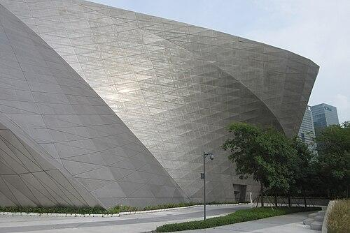

# 深圳当代艺术与城市规划馆

## 景点图片

> 图片来源：[Wikimedia Commons](https://commons.wikimedia.org/wiki/File:SZ_%E6%B7%B1%E5%9C%B3_Shenzhen_Futian_Fuzhong_Road_MOCAPE_Museum_of_Contemporary_Art_%26_Planning_Exhibition_facade_Sept_2017_IX1_03.jpg) · 许可证：CC BY-SA 4.0

## 基本信息

| 项目 | 内容 |
|------|------|
| 景点名称 | 深圳当代艺术与城市规划馆（MOCAPE） |
| 所在城市 | 深圳市 |
| 所在区县 | 福田区 |
| 景点级别 | 无 |
| 景点类型 | 艺术馆/博物馆 |
| 开放时间 | 周二至周日：10:00-17:00（16:30停止入馆）；周一闭馆 |
| 门票价格 | 免费（部分特展可能收费） |

## 景点介绍

深圳当代艺术与城市规划馆（MOCAPE）位于深圳市福田区中心地带，是深圳重要的文化地标建筑，由奥地利建筑师团队蓝天组（Coop Himmelb(l)au）设计。该馆集当代艺术展示和城市规划展览于一体，是深圳"新市民中心"文化建筑群的重要组成部分。

建筑外观极具现代感，以银色金属外墙和独特的曲面造型著称，是深圳市最具特色的建筑之一。馆内设有当代艺术展厅和城市规划展厅，定期举办各种艺术展览和城市规划展览。

深圳当代艺术与城市规划馆是深圳市重要的文化场所，也是了解深圳城市发展和当代艺术的重要窗口。

## 景点特点

- **深圳文化地标**：由蓝天组设计的现代建筑
- **当代艺术展示**：定期举办各种艺术展览
- **城市规划展览**：了解深圳城市发展
- **免费开放**：常设展览免费
- **建筑艺术**：银色金属外墙和独特曲面造型

## 位置

- **地址**：深圳市福田区福中路184号
- **经纬度**：22.5465°N, 114.0619°E

## 交通

- **地铁**：3号线/4号线少年宫站
- **公交**：多路公交至少年宫站
- **自驾**：可停放至周边停车场

## 数据来源

- [百度百科-深圳当代艺术与城市规划馆](https://baike.baidu.com/item/深圳当代艺术与城市规划馆)

## 最后更新时间

2026-06-20
