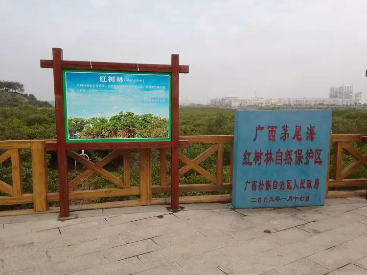

# 红树林自然保护区

## 景点图片

## 基本信息

| 项目 | 内容 |
|------|------|
| 景点名称 | 红树林自然保护区 |
| 所在城市 | 深圳市 |
| 所在区县 | 福田区 |
| 景点级别 | 3A |
| 景点类型 | 国家级自然保护区 |
| 开放时间 | 06:00-23:00（全年无休） |
| 门票价格 | 免费 |

## 景点介绍

红树林国家级自然保护区位于深圳市福田区滨海大道旁，是中国唯一位于城市中心区的红树林湿地自然保护区，也是深圳重要的生态名片。

保护区总面积约300公顷，拥有大面积的红树林湿地生态系统，是东亚—澳大利西亚候鸟迁飞通道上的重要中转站和越冬地。每年秋冬季节，数以万计的珍稀候鸟在此栖息，其中包括黑脸琵鹭、勺嘴鹬等国际濒危物种。

保护区内建有木栈道和观鸟平台，游客可沿栈道深入湿地，近距离观赏红树林植被、珍稀鸟类和湿地生态。这里既是生态科普教育的重要基地，也是市民亲近自然、休闲观鸟的理想场所。

## 景点特点

- 中国唯一位于城市中心区的红树林湿地自然保护区
- 东亚—澳大利西亚候鸟迁飞通道上的重要驿站
- 最佳观鸟期为冬季（11月至次年3月），可观赏黑脸琵鹭等珍稀鸟类
- 湿地木栈道和观鸟平台便于近距离观察自然生态
- 与深圳湾公园、人才公园相邻，可串联游览

## 位置

- **地址**：深圳市福田区滨河大道与滨海大道交汇处
- **经纬度**：22.5192°N, 114.0239°E## 交通

- **地铁**：9号线红树湾南站或红树湾站，步行约5-10分钟
- **公交**：M471路、M478路等线路至"红树林"站下车
- **自驾**：导航至"深圳红树林自然保护区"，周边设有停车场

## 注意事项

- 保护区内禁止野炊、烧烤、露营等活动
- 请保持安静，避免惊扰候鸟
- 建议携带望远镜以便更好地观鸟

## 数据来源

- [红树林自然保护区 - 百度百科](https://baike.baidu.com/item/%E7%BA%A2%E6%A0%91%E6%9E%97%E8%87%AA%E7%84%B6%E4%BF%9D%E6%8A%A4%E5%8C%BA/10589417)
- [百度百科 - 深圳红树林自然保护区](https://baike.baidu.com/item/深圳红树林自然保护区)
- [深圳市自然资源局](https://zrzyt.sz.gov.cn/)

## 最后更新时间

2026-07-11
