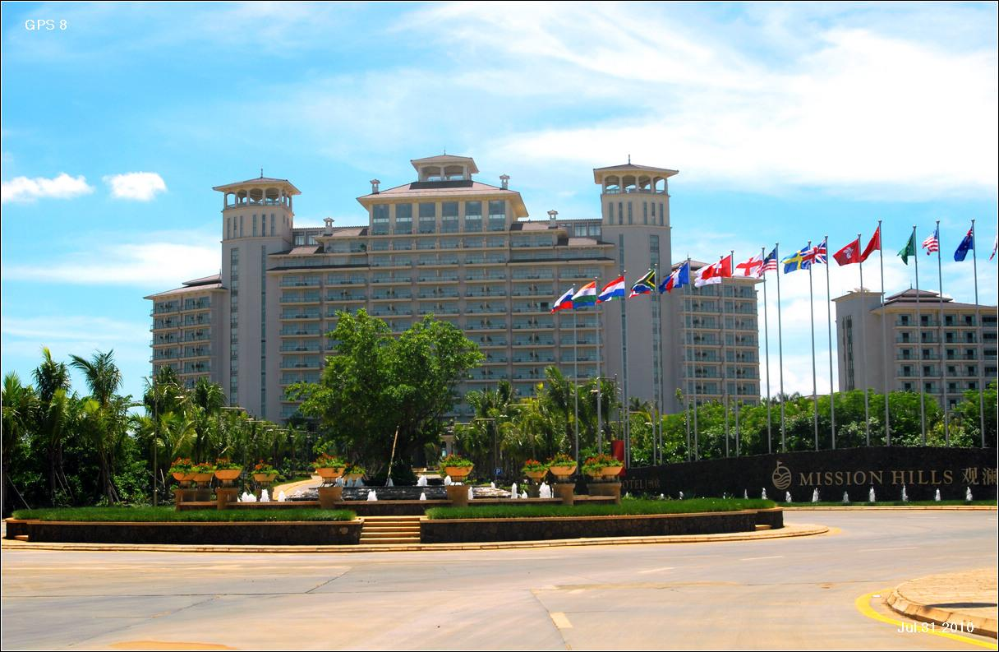

# 观澜湖休闲旅游区

## 景点图片

> 图片来源：[Wikimedia Commons](https://commons.wikimedia.org/wiki/File:%E8%A7%82%E6%BE%9C%E6%B9%96%E9%85%92%E5%BA%972010_-_panoramio.jpg) · 许可证：CC BY-SA 4.0

## 基本信息

| 项目 | 内容 |
|------|------|
| 景点名称 | 观澜湖休闲旅游区 |
| 所在城市 | 深圳市 |
| 所在区县 | 龙华区 |
| 景点级别 | 5A级景区 |
| 景点类型 | 综合休闲度假区 |
| 开放时间 | 09:00-21:00（周一至周日） |
| 门票价格 | 因项目而异 |

## 景点介绍

观澜湖休闲旅游区位于深圳市龙华区，是集高尔夫运动、休闲度假、文化娱乐、生态旅游为一体的大型综合旅游度假区。景区占地面积约20平方公里，拥有多个世界级高尔夫球场，曾连续多年举办高尔夫世界杯等国际赛事。

景区内设有观澜湖新城、观澜湖艺工场、观澜湖生态体育园等多个功能区域，融合了体育休闲、文化体验、生态观光等多种旅游元素，是深圳乃至珠三角地区重要的休闲度假目的地。

## 景点特点

- **世界级高尔夫球场**：拥有12个国际级高尔夫球场，是全球最大的高尔夫球会之一
- **国际赛事举办地**：曾举办高尔夫世界杯、观澜湖世界明星赛等国际顶级赛事
- **多元休闲体验**：涵盖高尔夫、网球、水疗、购物、餐饮等多种休闲业态
- **文创艺术空间**：观澜湖艺工场汇聚了众多手工艺人和文创品牌
- **生态体育公园**：集生态观光与体育运动于一体的综合性公园

## 位置

- **地址**：深圳市龙华区观澜街道高尔夫大道南
- **经纬度**：22.7232°N, 114.0762°E## 交通

- **地铁**：4号线观澜湖站，步行约10分钟
- **公交**：可乘坐M287、M338等路公交至观澜湖站下车
- **自驾**：梅观高速观澜出口下，沿高尔夫大道行驶即达

## 数据来源

- [深圳市文化广电旅游体育局](http://wtl.sz.gov.cn/)
- [观澜湖官方网站](https://www.missionhillschina.com/)

## 最后更新时间

2026-06-25
