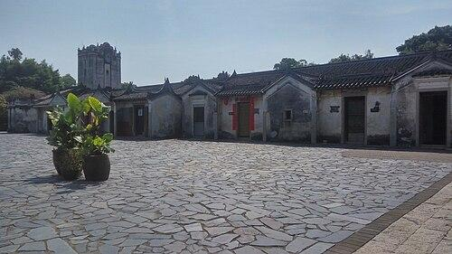

# 观澜版画村

## 景点图片

> 图片来源：[Wikimedia Commons](https://commons.wikimedia.org/wiki/File:%E6%B7%B1%E5%9C%B3%E8%A7%82%E6%BE%9C%E7%89%88%E7%94%BB%E6%9D%91.jpg) · 许可证：CC BY-SA 4.0

## 基本信息

| 项目 | 内容 |
|------|------|
| 景点名称 | 观澜版画村 |
| 所在城市 | 深圳市 |
| 所在区县 | 龙华区 |
| 景点级别 | - |
| 景点类型 | 文创村 |
| 开放时间 | 09:00-18:00（周一至周日） |
| 门票价格 | 免费 |

## 景点介绍

观澜版画村位于深圳市龙华区观澜街道，是由原有的客家古村落改造而成的国家级文化产业示范基地和中国版画艺术圣地。村内保存了大量具有岭南特色的客家建筑，与现代版画艺术完美融合，形成了独特的文化景观。

版画村占地面积约140万平方米，村内有版画工坊、艺术家工作室、展览馆、版画博物馆等设施。每年举办的深圳国际版画双年展吸引了来自世界各地的版画艺术家参展，使观澜版画村成为国际版画艺术交流的重要平台。游客在此可以参观版画展览、体验版画制作工艺、购买版画艺术品。

观澜版画村不仅是一处文化景点，更是深圳文化创意产业发展的缩影。古老的客家围屋与前卫的版画艺术在这里交汇碰撞，为这座年轻的城市注入了深厚的文化底蕴。

## 景点特点

- 客家古村落与版画艺术完美融合的独特文化景观
- 国家级文化产业示范基地，国际版画艺术交流平台
- 定期举办深圳国际版画双年展等大型艺术活动
- 可体验版画制作工艺，近距离感受版画艺术魅力

## 位置

- **地址**：龙华区观澜街道牛湖社区
- **经纬度**：22.7235°N, 114.089°E## 交通

- **地铁**：4号线观澜湖站，步行约15分钟
- **公交**：可乘坐M285路、M288路等公交车至版画村站下车
- **自驾**：导航至"观澜版画村"，村口设有停车场

## 数据来源

- [深圳市龙华区文化广电旅游体育局](https://lh.sz.gov.cn/)

## 最后更新时间

2026-06-20
