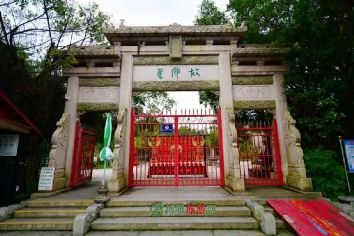

# 碧桂园假日半岛故乡里旅游度假区

## 景点图片

> 图片来源：[http://img.tcmap.com.cn/723/7232/w402427428.jpg](http://img.tcmap.com.cn/723/7232/w402427428.jpg) · 来源站点：博雅地名网

## 基本信息

| 项目 | 内容 |
|------|------|
| 景点名称 | 碧桂园假日半岛故乡里旅游度假区 |
| 所在城市 | 清远市 |
| 所在区县 | 清城区 |
| 景点级别 | 4A级景区 |
| 景点类型 | 主题公园/文化旅游区 |
| 开放时间 | 约09:00-17:30（以景区当日公告为准） |
| 门票价格 | 以景区当日公布价格为准 |

## 景点介绍

故乡里旅游度假区（清城区碧桂园假日半岛故乡里旅游度假区）位于清远市清城区石角镇，是国家4A级旅游景区。景区以岭南古镇风貌和祖辈生活展示为主题，汇集古建筑、民俗展演、手工体验与亲子游乐项目，适合家庭游客感受岭南传统生活场景。景区内前半部分突出文化展示，后半部分侧重户外娱乐与自然田园体验。

## 景点特点

- 国家4A级景区
- 岭南古建筑与民俗展示
- 祖辈生活场景体验
- 亲子游乐与户外项目
- 假日半岛度假配套

## 位置

- **地址**：清远市清城区石角镇碧桂园假日半岛内
- **经纬度**：23.4858°N, 113.0668°E

## 交通

- **高铁/火车**：清远站转乘公交或网约车约40-60分钟
- **公交**：清远市区乘车至石角镇/假日半岛方向
- **自驾**：广清高速相关出口后导航至“故乡里”

## 数据来源

- [清远A级旅游景区最新名单（清远本地宝）](https://qy.bendibao.com/tour/2025321/18410.shtm)
- [故乡里主题公园介绍（博雅地名网）](http://www.tcmap.com.cn/landscape/7/guxianglizhutigongyuan.html)

## 最后更新时间

2026-07-18
