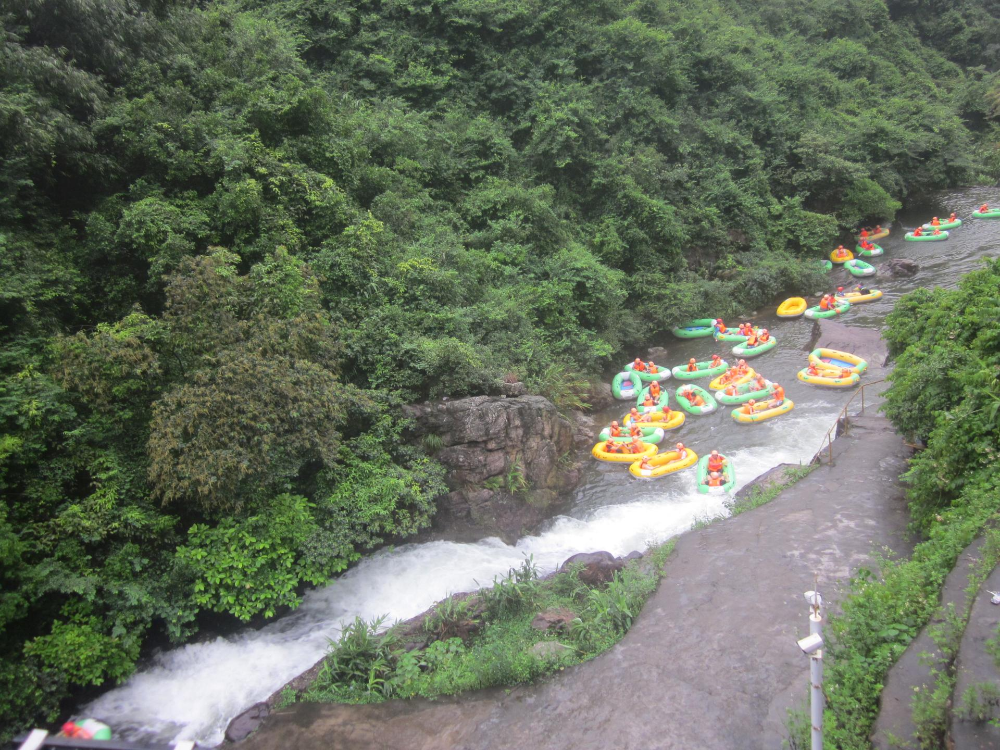

# 黄腾峡

## 景点图片

> 图片来源：[Wikimedia Commons](https://commons.wikimedia.org/wiki/File:Huangtengxia_Drifting3.jpg) · 许可证：CC BY-SA 4.0

## 基本信息

| 项目 | 内容 |
|------|------|
| 景点名称 | 黄腾峡 |
| 所在城市 | 清远市 |
| 所在区县 | 清城区 |
| 景点级别 | 4A级景区 |
| 景点类型 | 漂流/生态旅游 |
| 开放时间 | 09:00-17:00 |
| 门票价格 | 漂流约200-300元 |

## 景点介绍

黄腾峡位于清远市清城区东城街，是广东最著名的漂流景区之一。景区以其刺激的漂流体验和优美的自然风光闻名，被誉为"漂流之王"。峡谷全长约4.8公里，落差达180多米，漂流过程惊险刺激。

黄腾峡除了漂流项目外，还有天门悬廊、玻璃桥、飞龙滑道等丰富的游乐设施，是集漂流、观光、休闲于一体的综合性旅游景区。

## 景点特点

- **漂流之王**：广东最刺激的漂流项目之一
- **天门悬廊**：高空悬挑玻璃观景台，惊险刺激
- **玻璃桥**：横跨峡谷的高空玻璃桥
- **自然风光**：峡谷两岸山峰耸立，植被茂密
- **四季皆宜**：春季赏花、夏季漂流、秋季登高、冬季温泉

## 位置

- **地址**：清远市清城区东城街黄腾峡
- **经纬度**：23.7065°N, 113.0528°E

## 交通

- **高铁**：清远站，转乘公交或出租车约30分钟
- **自驾**：广清高速清远出口，沿S253省道

## 数据来源

- [清远市文化广电旅游体育局](http://whlyj.qingyuan.gov.cn/)

## 最后更新时间

2026-06-20
