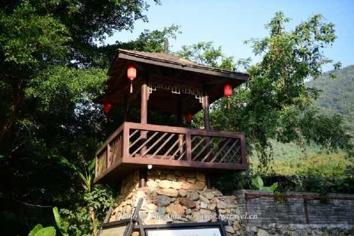

# 清远市九州驿站英德天门沟景区

## 景点图片

> 图片来源：[http://img.tcmap.com.cn/854/8544/w475438236.jpg](http://img.tcmap.com.cn/854/8544/w475438236.jpg) · 来源站点：博雅地名网

## 基本信息

| 项目 | 内容 |
|------|------|
| 景点名称 | 清远市九州驿站英德天门沟景区 |
| 所在城市 | 清远市 |
| 所在区县 | 英德市 |
| 景点级别 | 3A级景区 |
| 景点类型 | 峡谷/生态旅游景区 |
| 开放时间 | 以景区当日公示为准 |
| 门票价格 | 以景区当日公示为准 |

## 景点介绍

清远市九州驿站英德天门沟景区位于英德市石牯塘镇八宝围仔村委天门沟一带，是国家AAA级旅游景区。

景区以峡谷溪流、山地生态和户外休闲环境为特色，适合徒步观光、亲近自然和短途度假。对希望避开热门大景区、体验英德山野沟谷风光的游客，天门沟是较有代表性的选择之一。

常用简称/别称：天门沟。

## 景点特点

- 国家3A级景区
- 以峡谷沟谷与生态休闲为主要特色
- 适合徒步、观景和短途自然游
- 位于石牯塘镇，适合自驾前往

## 位置

- **地址**：英德市石牯塘镇八宝围仔村委天门沟景区
- **经纬度**：24.4063°N, 113.1099°E
## 交通

- **高铁/火车**：至英德站后转乘出租车、包车或客运前往石牯塘镇
- **客运**：英德市区乘坐开往石牯塘方向班车，再转乘当地交通工具
- **自驾**：导航“天门沟景区”或“九州驿站英德天门沟”

## 数据来源

- [清远A级景区名单（本地宝）](https://qy.bendibao.com/tour/2025321/18410.shtm)
- [清远最全的5A、4A、3A级景区（搜狐）](https://www.sohu.com/a/431455016_493344)

## 最后更新时间

2026-07-18
