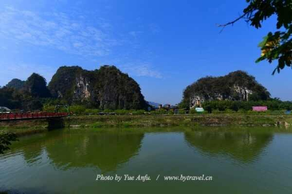

# 九龙峰林晓镇

## 景点图片

> 图片来源：[http://img.tcmap.com.cn/855/8558/w476217196.jpg](http://img.tcmap.com.cn/855/8558/w476217196.jpg) · 来源站点：博雅地名网

## 基本信息

| 项目 | 内容 |
|------|------|
| 景点名称 | 九龙峰林晓镇 |
| 所在城市 | 清远市 |
| 所在区县 | 英德市 |
| 景点级别 | 4A级景区 |
| 景点类型 | 峰林/乡村旅游度假区 |
| 开放时间 | 约08:30-17:30（以景区当日公告为准） |
| 门票价格 | 以景区当日公布价格为准 |

## 景点介绍

九龙峰林小镇（清远英德九龙峰林晓镇/小镇）位于英德市九龙镇，地处英西峰林核心区域，是国家4A级旅游景区。景区内石灰岩峰林连绵，田园、花海、溪流与乡村聚落交织，兼具自然观光、休闲度假、研学和户外体验功能，是欣赏“广东小桂林”式峰林风光的重要落脚点。

## 景点特点

- 国家4A级景区
- 英西峰林核心段
- 田园花海与乡村风光
- 休闲度假与户外体验
- 适合摄影与自驾

## 位置

- **地址**：广东省英德市九龙镇
- **经纬度**：24.1215°N, 112.9232°E

## 交通

- **高铁/火车**：英德西站后包车或转乘前往九龙镇
- **公交**：英德市区乘车至九龙镇后转当地交通
- **自驾**：导航至“九龙峰林小镇/英西峰林九龙镇”

## 数据来源

- [清远A级旅游景区最新名单（清远本地宝）](https://qy.bendibao.com/tour/2025321/18410.shtm)
- [九龙峰林小镇介绍（博雅地名网）](http://www.tcmap.com.cn/landscape/93/jiulongxiaozhen.html)

## 最后更新时间

2026-07-18
