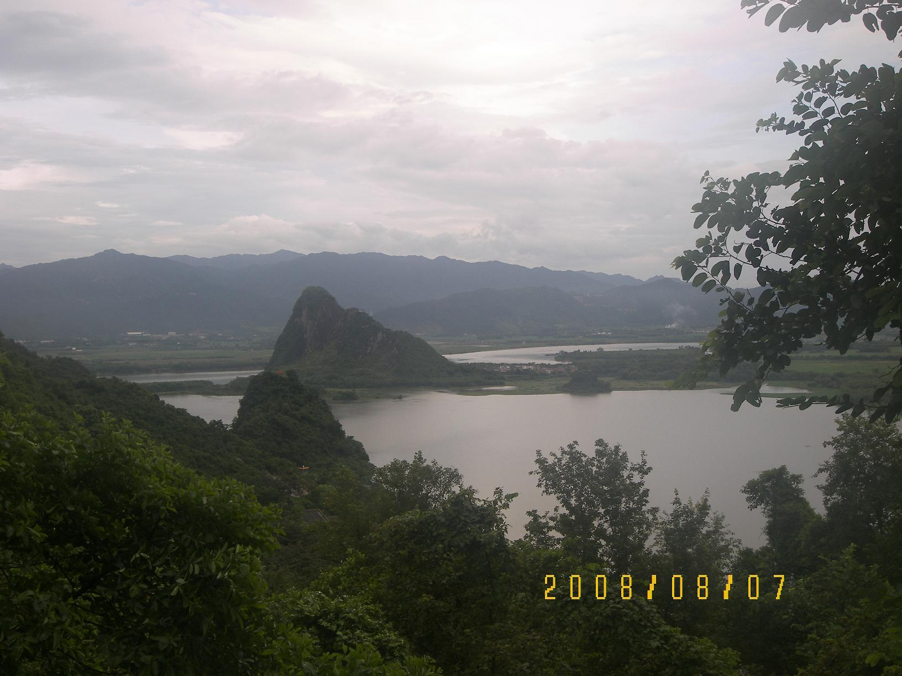

# 宝晶宫

## 景点图片

> 图片来源：[Wikimedia Commons](https://commons.wikimedia.org/wiki/File:%E5%B9%BF%E4%B8%9C%E8%8B%B1%E5%BE%B7%E5%AE%9D%E6%99%B6%E5%AE%AB%E5%A4%96%E6%99%AF%20-%20panoramio.jpg) · 许可证：CC BY-SA 4.0

## 基本信息

| 项目 | 内容 |
|------|------|
| 景点名称 | 宝晶宫 |
| 所在城市 | 清远市 |
| 所在区县 | 英德市 |
| 景点级别 | 4A级景区 |
| 景点类型 | 溶洞景观 |
| 开放时间 | 08:30-17:00 |
| 门票价格 | 约85元/人 |

## 景点介绍

宝晶宫位于清远市英德市，是广东省规模最大、保存最完好的喀斯特溶洞之一，被誉为"岭南第一洞天"。宝晶宫是一个经历了两亿多年地壳运动形成的石灰岩溶洞，洞内面积约16000平方米，游程约1.5公里。

宝晶宫分为上下两层共七个大厅，洞内钟乳石千姿百态，石笋、石柱、石幔、石花等琳琅满目，在灯光映衬下绚丽多彩。最著名的景观有"宝晶宫大佛"、"玉液琼浆"、"蓬莱仙境"等，令人叹为观止。

宝晶宫景区内还有碧落湖、狮子山等自然景观，以及玻璃桥、飞龙蹦极等刺激的游乐项目，是清远市最具代表性的旅游景点之一。

## 景点特点

- **岭南第一洞天**：广东省规模最大、保存最完好的喀斯特溶洞
- **七个大厅**：洞内分为上下两层共七个大厅
- **钟乳石奇观**：石笋、石柱、石幔、石花等千姿百态
- **碧落湖**：景区内的天然湖泊
- **刺激项目**：玻璃桥、飞龙蹦极等游乐项目

## 位置

- **地址**：清远市英德市望埠镇宝晶宫景区
- **经纬度**：24.125°N, 113.3687°E

## 交通

- **自驾**：清远市区出发约1小时车程
- **公交**：英德市内有旅游专线可达

## 数据来源

- [百度百科-宝晶宫](https://baike.baidu.com/item/宝晶宫)

## 最后更新时间

2026-06-20
