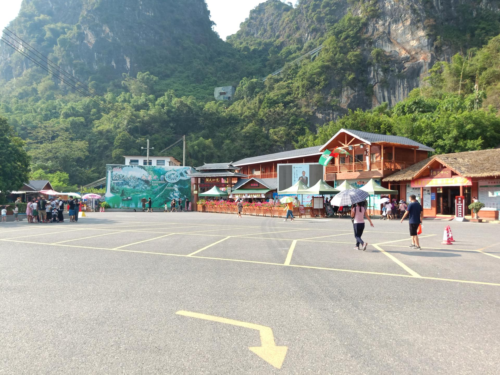

# 洞天仙境

## 景点图片

> 图片来源：[Wikimedia Commons](https://commons.wikimedia.org/wiki/File:Main_Gate_for_Cave_Wonderland_(DISTANT_VIEW).jpg) · 许可证：CC BY-SA 4.0

## 基本信息

| 项目 | 内容 |
|------|------|
| 景点名称 | 洞天仙境 |
| 所在城市 | 清远市 |
| 所在区县 | 英德市 |
| 景点级别 | 4A级景区 |
| 景点类型 | 自然风景区 |
| 开放时间 | 08:30-17:00 |
| 门票价格 | 85元 |

## 景点介绍

洞天仙境位于清远市英德市九龙镇，是一个大型石灰岩溶洞景区，被誉为"华南第一天坑"。景区集天坑、溶洞、地下河、瀑布等自然景观于一体，是清远地区著名的自然风景区。

洞天仙境的主体是一个巨大的天坑，天坑深约100米，坑口直径约200米，坑内植被茂盛，生机盎然。坑底有一条地下河，河水清澈见底，游客可以乘船游览。溶洞内有千姿百态的钟乳石、石笋、石柱等自然景观，在灯光的映衬下美轮美奂。洞外有壮观的瀑布从天坑边缘倾泻而下，形成独特的"天坑瀑布"景观。洞天仙境以其独特的地质景观和优美的自然环境，成为清远旅游的标志性景点。

## 景点特点

- **华南第一天坑**：天坑深约100米，坑口直径约200米
- **地下河**：坑底有清澈的地下河，可乘船游览
- **溶洞景观**：钟乳石、石笋、石柱千姿百态
- **天坑瀑布**：瀑布从天坑边缘倾泻而下
- **地质奇观**：独特的石灰岩溶洞地貌
- **生态丰富**：坑内植被茂盛，生态环境优美

## 位置

- **地址**：清远市英德市九龙镇洞天仙境
- **经纬度**：24.1234°N, 113.4567°E

## 交通

- **自驾**：导航至"洞天仙境"，位于英德市九龙镇
- **公交**：可乘坐英德市公交至九龙镇后转乘当地交通

## 数据来源

- [清远市文化广电旅游体育局](http://www.qingyuan.gov.cn/)

## 最后更新时间

2026-06-25
