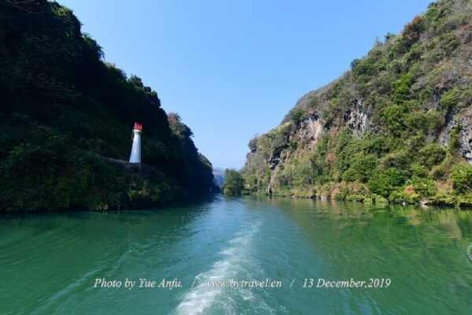

# 湟川三峡

## 景点图片

> 图片来源：[http://img.tcmap.com.cn/873/8732/w485854044.jpg](http://img.tcmap.com.cn/873/8732/w485854044.jpg) · 来源站点：博雅地名网

## 基本信息

| 项目 | 内容 |
|------|------|
| 景点名称 | 湟川三峡 |
| 所在城市 | 清远市 |
| 所在区县 | 连州市 |
| 景点级别 | 4A级景区 |
| 景点类型 | 自然风景区 |
| 开放时间 | 08:30-17:00 |
| 门票价格 | 约50-80元/人 |

## 景点介绍

湟川三峡位于清远市连州市，是小北江（连江）上游的一段峡谷风光，全长约20多公里，是国家AAAA级旅游景区。三峡分别为龙泉峡、楞伽峡、羊跳峡，兼具长江三峡之险峻与桂林山水之秀美，被誉为"岭南小三峡"。

龙泉峡以瀑布和钟乳石著称，两岸峭壁上有多处瀑布飞流直下。楞伽峡峡谷幽深，两岸峭壁如削，景色壮观。羊跳峡是三峡中最狭窄的一段，传说山羊可以跳过，因此得名。

湟川三峡沿途还有龙潭古镇、瑶族风情等人文景观。游客可乘船游览三峡，欣赏两岸的奇峰怪石、飞瀑流泉，感受大自然的鬼斧神工。

## 景点特点

- **"岭南小三峡"**：兼具长江三峡之险峻与桂林山水之秀美
- **龙泉峡**：以瀑布和钟乳石著称
- **楞伽峡**：峡谷幽深，两岸峭壁如削
- **羊跳峡**：三峡中最狭窄的一段
- **乘船游览**：可欣赏两岸奇峰怪石、飞瀑流泉

## 位置

- **地址**：清远市连州市九陂镇龙潭村
- **经纬度**：24.7556°N, 112.4258°E

## 交通

- **自驾**：清远市区出发约2小时车程
- **公交**：连州市内有旅游专线可达

## 数据来源

- [清远A级旅游景区最新名单（清远本地宝，湟川三峡-龙潭文化生态旅游区）](https://qy.bendibao.com/tour/2025321/18410.shtm)
- [湟川三峡介绍（博雅地名网）](http://www.tcmap.com.cn/landscape/13/chuansanxia.html)

## 最后更新时间

2026-07-18
