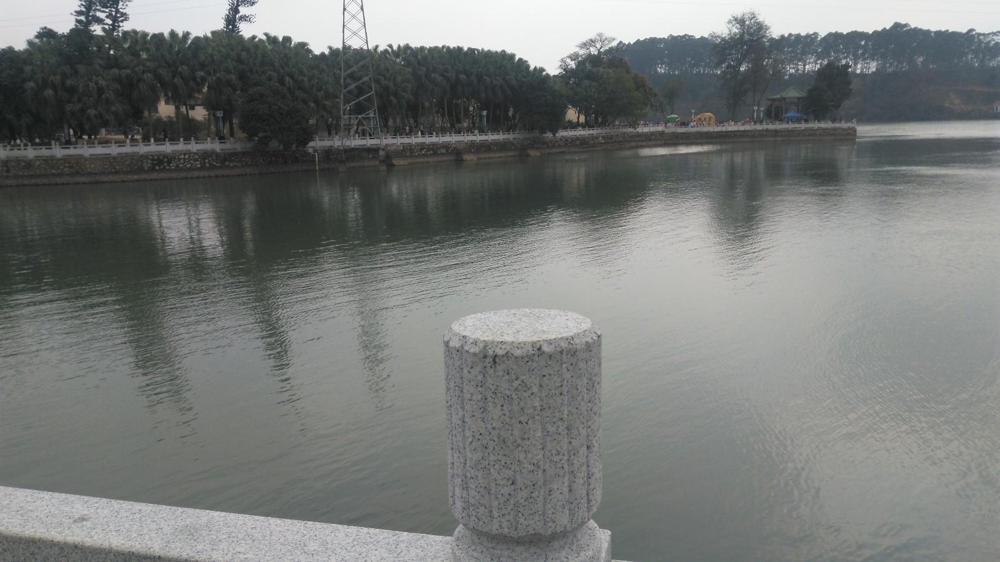

# 鹤地水库

## 景点图片

> 图片来源：[新浪网](https://n.sinaimg.cn/sinacn20/100/w1600h900/20180829/e92f-hikcahf5555444.jpg)

## 基本信息

| 项目 | 内容 |
|------|------|
| 景点名称 | 鹤地水库（鹤地银湖） |
| 所在城市 | 湛江市 |
| 所在区县 | 廉江市 |
| 景点级别 | 国家AAA级旅游景区、国家水利风景区 |
| 景点类型 | 水利风景区 |
| 开放时间 | 全天开放 |
| 门票价格 | 免费 |

## 景点介绍

鹤地水库位于湛江市廉江市，是广东省最大的水库之一，也是国家水利风景区。水库始建于1958年，是雷州半岛重要的水利枢纽工程。水库面积约122平方公里，库容量约11.5亿立方米。

鹤地水库四周群山环抱，湖面碧波荡漾，景色十分优美。水库内有300多个大小岛屿，形成了独特的湖岛风光。游客可以乘船游览水库，欣赏湖光山色和岛屿风光。水库周边还有青年亭、雷州青年运河纪念馆等景点。

鹤地水库不仅是重要的水利设施，也是湛江市著名的旅游景点和休闲度假胜地。

## 景点特点

- **广东省最大水库之一**：面积约122平方公里
- **国家水利风景区**：湖光山色，景色优美
- **300多个岛屿**：形成独特的湖岛风光
- **乘船游览**：可欣赏水库风光
- **雷州青年运河**：重要的水利工程历史遗迹

## 位置

- **地址**：湛江市廉江市鹤地水库
- **经纬度**：21.7214°N, 110.3051°E

## 交通

- **自驾**：湛江市区出发约1小时车程
- **公交**：廉江市内有公交可达

## 数据来源

- [百度百科-鹤地水库](https://baike.baidu.com/item/鹤地水库)

## 最后更新时间

2026-07-19

