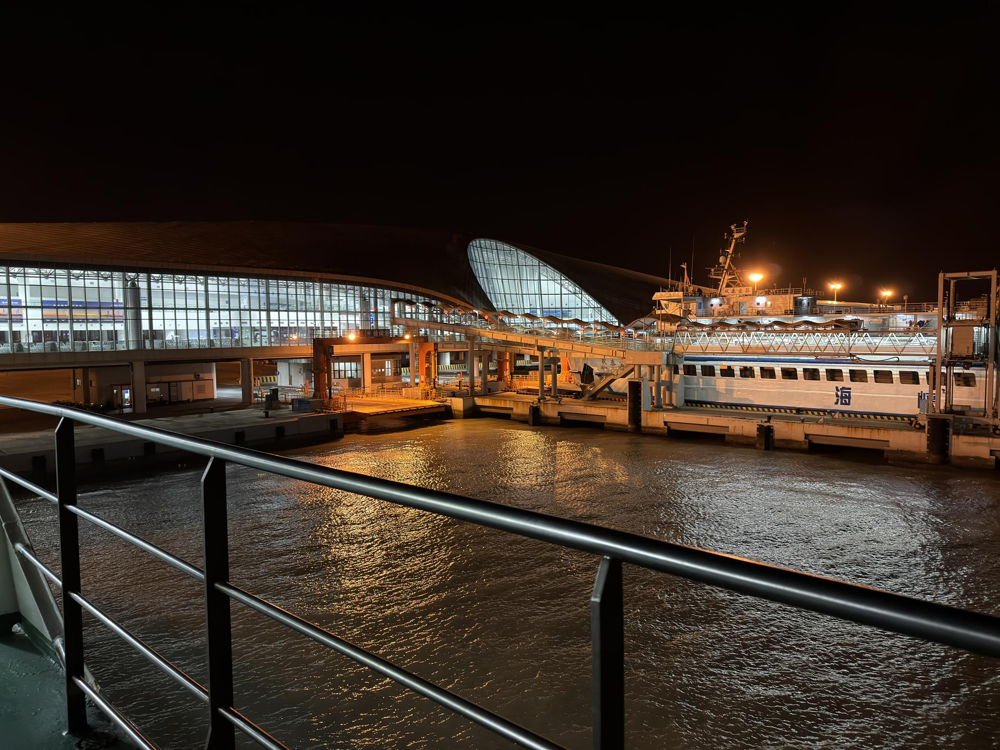

# 徐闻古港

## 景点图片

> 图片来源：[Wikimedia Commons](https://commons.wikimedia.org/wiki/File:Docks_at_Xuwen_Port_-_01.jpg) · 许可证：CC BY-SA 4.0

## 基本信息

| 项目 | 内容 |
|------|------|
| 景点名称 | 徐闻古港 |
| 所在城市 | 湛江市 |
| 所在区县 | 徐闻县 |
| 景点级别 | 无 |
| 景点类型 | 历史文化景点 |
| 开放时间 | 全天开放 |
| 门票价格 | 免费 |

## 景点介绍

徐闻古港位于湛江市徐闻县，是汉代海上丝绸之路的始发港之一。古港遗址保存有汉代的航标、码头等遗迹，是研究中国古代海上丝绸之路的重要实物资料。据《汉书·地理志》记载，徐闻古港是中国古代对外贸易的重要港口，从这里出发的商船可到达东南亚、南亚等地。这里见证了古代中国与世界的海上交流历史。

## 景点特点

1. **历史地位重要**：汉代海上丝绸之路始发港之一
2. **考古价值高**：保存有汉代航标、码头等遗迹
3. **文献记载丰富**：见于《汉书·地理志》等历史文献
4. **研究意义重大**：是研究古代海上丝绸之路的重要实物资料
5. **文化传承地**：见证古代中国与世界的海上交流历史

## 位置

- **地址**：湛江市徐闻县五里乡二桥村
- **经纬度**：20.3256°N, 110.1725°E

## 交通

- **地铁**：无
- **公交**：徐闻县城乘坐前往五里乡的班车
- **自驾**：从徐闻县城出发，沿X684县道向五里乡方向行驶，约20分钟车程

## 数据来源

- [湛江市文化广电旅游体育局](http://www.zhanjiang.gov.cn/gkmlpt/content/2/2292/post_2292123.html)

## 最后更新时间

2026-06-25
