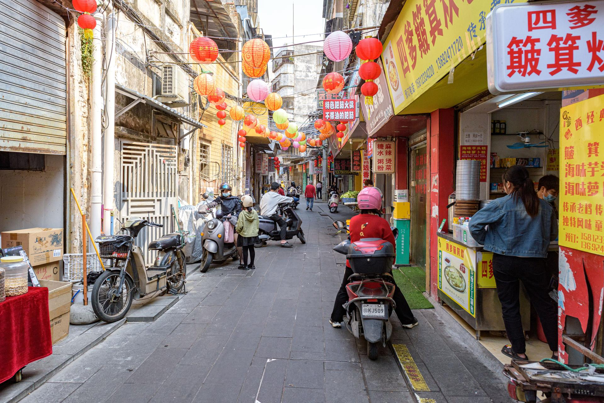

# 赤坎老街

## 景点图片

> 图片来源：[Wikimedia Commons](https://commons.wikimedia.org/wiki/File:Zhongxing_St,_Chikan,_Zhanjiang_(20240219105534).jpg) · 许可证：CC BY-SA 4.0

## 基本信息

| 项目 | 内容 |
|------|------|
| 景点名称 | 赤坎老街 |
| 所在城市 | 湛江市 |
| 所在区县 | 赤坎区 |
| 景点级别 | 无 |
| 景点类型 | 历史文化街区 |
| 开放时间 | 全天开放 |
| 门票价格 | 免费 |

## 景点介绍

赤坎老街位于湛江市赤坎区，是湛江市最具特色的历史文化街区。赤坎老街始建于清代，至今已有300多年的历史，是湛江近代商业发展的重要见证。

赤坎老街保存有大量清末民初时期的骑楼建筑，融合了岭南传统建筑和西方建筑风格。街道两旁商铺林立，古色古香，保留着浓厚的历史氛围。

赤坎老街是湛江市最重要的历史文化遗产，也是了解湛江近代历史的重要窗口。

## 景点特点

- **300年历史**：始建于清代，湛江近代商业发展的重要见证
- **骑楼建筑群**：融合岭南传统建筑和西方建筑风格
- **历史氛围**：保留浓厚的历史氛围
- **免费开放**：全天开放
- **文化遗产**：湛江市最重要的历史文化遗产

## 位置

- **地址**：湛江市赤坎区赤坎老街
- **经纬度**：21.2763°N, 110.3638°E

## 交通

- **公交**：湛江市内多路公交可达
- **自驾**：可停放至周边停车场

## 数据来源

- [百度百科-赤坎老街](https://baike.baidu.com/item/赤坎老街)

## 最后更新时间

2026-06-20
