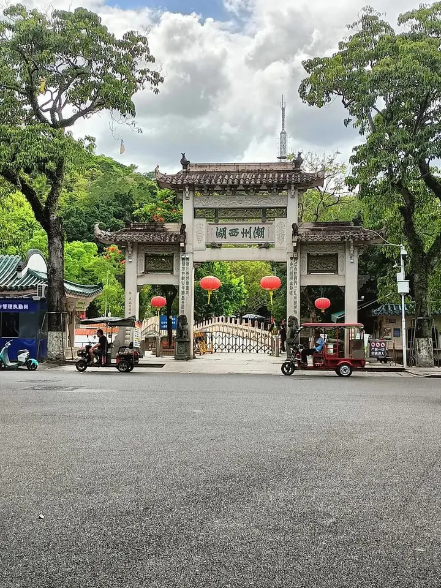

# 潮州西湖

## 景点图片

> 图片来源：[百度图片检索](https://image.baidu.com/search/index?tn=baiduimage&word=潮州西湖)；原始来源见检索结果。

## 基本信息

| 项目 | 内容 |
|------|------|
| 景点名称 | 潮州西湖 |
| 所在城市 | 潮州市 |
| 所在区县 | 湘桥区 |
| 景点级别 | - |
| 景点类型 | 公园/湖泊 |
| 开放时间 | 全天开放 |
| 门票价格 | 免费 |

## 景点介绍

潮州西湖位于潮州市湘桥区，是潮州市最著名的城市公园，也是潮州市民休闲娱乐的重要场所。潮州西湖始建于唐代，至今已有1000多年的历史，是潮州古八景之一"西湖渔筏"的所在地。

潮州西湖面积约10公顷，湖水清澈，绿树成荫，环境优美。湖中有湖心亭、九曲桥等景观，湖畔有涵碧楼、芙蓉池、步月亭等历史建筑。涵碧楼是潮州西湖最著名的建筑，始建于宋代，是潮州古八景之一。

潮州西湖是潮州市民休闲健身的热门去处，也是游客了解潮州历史文化的重要窗口。

## 景点特点

- **1000多年历史**：始建于唐代，潮州古八景之一
- **涵碧楼**：始建于宋代，潮州古八景之一
- **湖心亭**：湖中小亭，景色优美
- **九曲桥**：蜿蜒曲折的石桥
- **免费开放**：潮州市民休闲健身的热门去处

## 位置

- **地址**：潮州市湘桥区潮州西湖
- **经纬度**：23.6674°N, 116.6407°E

## 交通

- **公交**：潮州市内多路公交可达
- **自驾**：可停放至周边停车场

## 数据来源

- [百度百科-潮州西湖](https://baike.baidu.com/item/潮州西湖)

## 最后更新时间

2026-06-20
