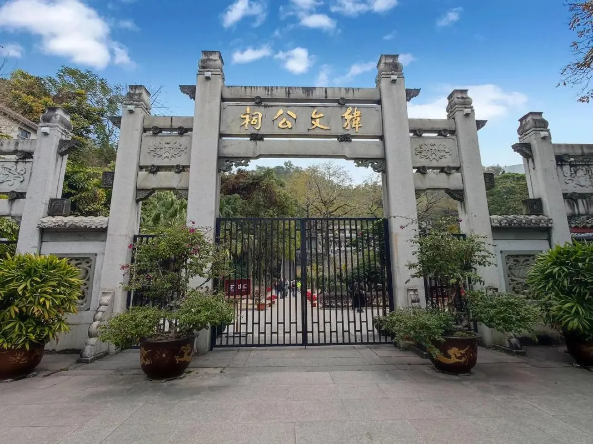

# 韩文公祠

## 景点图片

> 图片来源：[百度图片检索](https://image.baidu.com/search/index?tn=baiduimage&word=潮州韩文公祠)；原始来源见检索结果。

## 基本信息

| 项目 | 内容 |
|------|------|
| 景点名称 | 韩文公祠 |
| 所在城市 | 潮州市 |
| 所在区县 | 湘桥区 |
| 景点类型 | 历史建筑 |
| 景点级别 | 全国重点文物保护单位 |
| 开放时间 | 08:00-18:00 |
| 门票价格 | 免费 |
| 建议游玩时间 | 1-2小时 |
| 适合人群 | 历史文化爱好者、文学爱好者、建筑爱好者 |

## 景点介绍

韩文公祠位于潮州市湘桥区，是纪念唐代文学家韩愈的祠堂，始建于北宋咸平二年（999年），是中国现存纪念韩愈的最大祠宇。韩愈曾被贬潮州，在任期间兴办教育、驱除鳄鱼、释放奴婢，深受潮州人民爱戴。韩文公祠依山而建，环境清幽，祠内保留有大量碑刻和文物，是潮州重要的文化景点。

## 景点特点

- 纪念韩愈的最大祠宇，历史悠久
- 依山而建，环境清幽，建筑古朴典雅
- 祠内碑刻众多，书法艺术价值高
- 是潮州文脉的象征，文化底蕴深厚
- 与广济桥隔江相望，可俯瞰韩江美景
- 祠内古树参天，四季常青

## 位置

- **地址**：广东省潮州市湘桥区桥东街道韩江东岸笔架山麓
- **经纬度**：23.6635°N, 116.659°E

## 交通

- **自驾**：导航至韩文公祠
- **公交**：可乘坐多路公交至韩文公祠站
- **步行**：位于古城附近，步行可达
- **出租车**：可直接告诉司机前往韩文公祠

## 数据来源

- [百度百科-韩文公祠](https://baike.baidu.com/item/韩文公祠)

## 最后更新时间

2026-06-20
