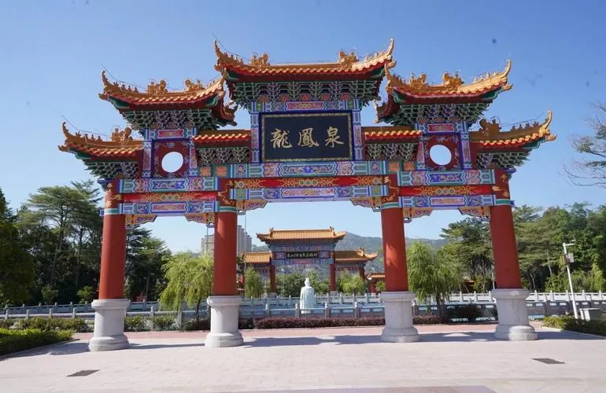

# 东山湖度假村

## 景点图片

> 图片来源：[百度图片检索](https://image.baidu.com/search/index?tn=baiduimage&word=潮州东山湖温泉度假村)；原始来源见检索结果。

## 基本信息

| 项目 | 内容 |
|------|------|
| 景点名称 | 东山湖度假村 |
| 所在城市 | 潮州市 |
| 所在区县 | 潮安区 |
| 景点类型 | 温泉度假村 |
| 景点级别 | 国家 4A 级旅游景区 |
| 开放时间 | 通常 16:00-23:00，具体以景区当日公告为准 |
| 门票价格 | 温泉票约 88-99 元，具体以购票页面为准 |
| 建议游玩时间 | 4-6 小时 |
| 适合人群 | 亲子家庭、休闲度假游客、温泉爱好者 |

## 景点介绍

东山湖度假村位于潮州市潮安区沙溪镇，地处潮州、汕头、揭阳三市交界附近，是以温泉资源和生态环境为基础的休闲度假景区。度假村集温泉体验、住宿、餐饮和休闲娱乐于一体，适合安排半日或一日休闲行程。

## 景点特点

- 以天然温泉和休闲度假为主要特色
- 结合山林、水体等自然环境，适合放松和康体休闲
- 提供温泉泡池、住宿及餐饮等综合度假服务
- 开放时间和票价可能随季节、活动调整，出行前应核实

## 位置

- **地址**：广东省潮州市潮安区沙溪镇 078 县道
- **经纬度**：23.5052°N, 116.5862°E

## 交通

- **自驾**：导航至“东山湖温泉度假村”，可经汕揭高速沙溪出入口前往
- **公共交通**：建议先到潮州市区或潮安区，再换乘当地公交、网约车或出租车

## 数据来源

- [百度百科-东山湖温泉度假村](https://baike.baidu.com/item/东山湖温泉度假村)

## 最后更新时间

2026-07-14
