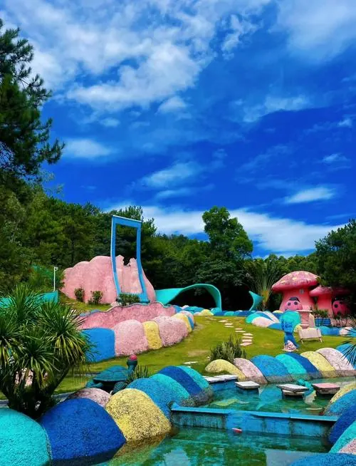

# 绿太阳生态旅游度假区

## 景点图片

> 图片来源：[百度图片检索](https://image.baidu.com/search/index?tn=baiduimage&word=潮州绿太阳生态旅游度假区)；原始来源见检索结果。

## 基本信息

| 项目 | 内容 |
|------|------|
| 景点名称 | 绿太阳生态旅游度假区 |
| 所在城市 | 潮州市 |
| 所在区县 | 潮安区 |
| 景点类型 | 生态旅游度假区 |
| 景点级别 | 国家 4A 级旅游景区 |
| 开放时间 | 以景区当日公告为准 |
| 门票价格 | 参考成人票约 68 元，具体以购票页面为准 |
| 建议游玩时间 | 4-6 小时 |
| 适合人群 | 亲子家庭、生态休闲游客、摄影爱好者 |

## 景点介绍

绿太阳生态旅游度假区位于潮州市潮安区登塘镇，距离潮州市区约 13 公里，是集生态观光、休闲度假和游乐体验于一体的综合型旅游景区。景区将欧陆风情园林与中华传统园林相结合，园内有水景、园林景观和休闲娱乐设施。

## 景点特点

- 以生态园林和休闲度假为主要特色
- 欧陆风情园林与传统园林景观相结合
- 设有水景、游乐和亲子体验等项目
- 景区范围较大，适合预留半天以上游览时间

## 位置

- **地址**：广东省潮州市潮安区登塘镇杨美村大坑水库附近
- **经纬度**：23.6825°N, 116.5081°E

## 交通

- **自驾**：导航至“绿太阳生态旅游度假区”，按导航前往登塘镇杨美村
- **公共交通**：建议先到潮州市区，再换乘网约车或出租车前往景区

## 数据来源

- [百度百科-绿太阳生态旅游度假区](https://baike.baidu.com/item/绿太阳生态旅游度假区)

## 最后更新时间

2026-07-14
