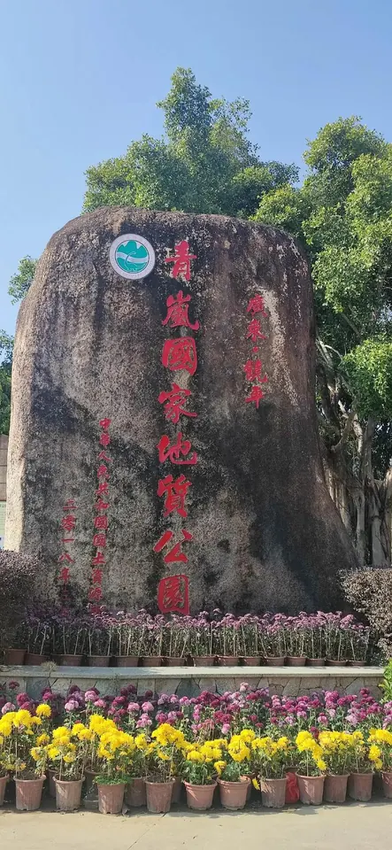

# 青岚地质公园

## 景点图片

> 图片来源：[百度图片检索](https://image.baidu.com/search/index?tn=baiduimage&word=饶平青岚地质公园)；原始来源见检索结果。

## 基本信息

| 项目 | 详情 |
|------|------|
| 景点名称 | 青岚地质公园 |
| 所在城市 | 潮州市 |
| 所在地区 | 潮州市饶平县 |
| 景点类型 | 地质公园 |
| 景点等级 | 国家4A级旅游景区 |
| 评级时间 | 2019年 |
| 开放时间 | 08:00-18:00 |
| 门票价格 | 约60元 |
| 建议游玩时间 | 半天至一天 |
| 适合人群 | 自然风光爱好者、亲子游、地质科普爱好者 |

## 景点介绍

青岚地质公园位于潮州市饶平县浮滨镇，距离饶平县城约20公里，总面积约10平方公里。该公园以奇特的地质地貌著称，拥有大量的岩石奇观和洞穴景观，是集地质遗迹保护、自然风光游览和科普教育于一体的综合性旅游景区。公园内地质构造复杂，岩层丰富，形成了众多独特的地貌景观，如石柱、石笋、石幔等。核心景区"怪剑石"以其独特的石柱群和峡谷景观闻名，这些石柱形似利剑直指苍穹，气势磅礴。此外，公园内还有清澈的溪流、茂密的植被和丰富的动植物资源，是饶平县重要的生态旅游目的地。2019年，青岚地质公园被评为国家4A级旅游景区。

## 景点特点

- 国家4A级旅游景区，2019年获评
- 以奇特的地质地貌和岩石奇观著称
- 核心景区"怪剑石"拥有壮观的石柱群和峡谷景观
- 地质构造复杂，岩层丰富，科普价值高
- 拥有清澈溪流、茂密植被和丰富的动植物资源
- 设有多个地质科普教育点
- 保留传统客家文化，可体验地道客家美食
- 适合亲子游和户外探险

## 位置

- **地址**：广东省潮州市饶平县浮滨镇
- **经纬度**：23.7352°N, 116.8089°E

## 交通

- **自驾**：导航至青岚地质公园，从饶平县城出发约30分钟车程
- **公交**：可从饶平县城乘坐前往浮滨镇的班车，在青岚地质公园站下车
- **包车**：建议从潮州市区包车前往，全程约1.5小时

## 数据来源

- [百度百科-青岚地质公园](https://baike.baidu.com/item/青岚地质公园)

## 最后更新时间

2026-07-11
