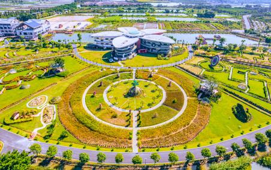

# 岭南大地百草园景区

## 景点图片

> 图片来源：[百度百科](https://bkimg.cdn.bcebos.com/smart/b64543a98226cffc1e175550b15d5d90f603728dbc87-bkimg-process,v_1,rw_1280,rh_803,maxl_452?x-bce-process=image/format,f_auto)

## 基本信息

| 项目 | 内容 |
|------|------|
| 景点名称 | 岭南大地百草园景区 |
| 所在城市 | 珠海市 |
| 所在区县 | 斗门区 |
| 景点级别 | 3A级景区 |
| 景点类型 | 生态农业/科普教育 |
| 开放时间 | 09:00-17:30 |
| 门票价格 | 约50元/人 |

## 景点介绍

岭南大地百草园景区位于珠海市斗门区莲洲镇，是国家3A级旅游景区，也是岭南大地田园综合体项目的核心组成部分。景区以岭南传统中医药文化为主题，结合现代农业科技和生态休闲理念，打造集科普教育、生态观光、休闲体验于一体的综合性旅游景区。园区占地面积广阔，种植了数百种岭南地区常见的中草药植物，是华南地区重要的中医药文化科普基地。

走进百草园，游客可以欣赏到按照岭南传统园林风格精心打造的景观，园内小桥流水、亭台楼阁、花木葱茏，处处体现着岭南园林的精致与雅致。园区按功能分为中草药种植区、科普展示区、互动体验区和休闲观光区。中草药种植区种植了包括广藿香、巴戟天、沉香、化橘红等岭南道地药材，游客可以近距离观察和了解各种中草药的形态特征和药用价值。

百草园科普展示区设有中医药文化展览馆，通过图文展板、实物标本、多媒体互动等方式，系统展示中医药文化的发展历程、理论体系和岭南中医药的特色。互动体验区则提供中草药香囊制作、植物拓印、中药辨识等体验项目，让游客在亲手操作中感受中医药文化的魅力。此外，景区还设有生态餐厅，提供以药膳为特色的健康餐饮。

岭南大地百草园景区是斗门区乡村振兴和文旅融合发展的示范项目，不仅为游客提供了一个了解中医药文化的窗口，也为当地农业转型升级和农民增收致富发挥了积极作用。景区周边还配套有民宿、采摘园等设施，适合游客前来开展深度乡村休闲体验。

## 景点特点

- **国家3A级景区**：珠海斗门区重要的生态文化旅游景区
- **岭南中医药文化主题**：以岭南道地药材和传统中医药文化为核心
- **生态科普教育**：数百种中草药植物，科普展示馆系统介绍中医药知识
- **互动体验项目**：香囊制作、植物拓印、中药辨识等体验活动
- **岭南园林风格**：小桥流水、亭台楼阁，展现岭南园林精致之美
- **药膳餐饮**：提供以药膳为特色的健康美食体验

## 位置

- **地址**：珠海市斗门区莲洲镇岭南大地
- **经纬度**：22.290°N, 113.250°E

## 交通

- **公交**：珠海市内乘坐401路、402路公交至莲洲镇站，再换乘当地公交或打车前往
- **自驾**：导航至"岭南大地百草园"，有停车场，珠海市区出发约50分钟车程

## 数据来源

- [岭南大地百草园 - 百度百科](https://baike.baidu.com/item/%E5%B2%AD%E5%8D%97%E5%A4%A7%E5%9C%B0%E7%99%BE%E8%8D%89%E5%9B%AD)

## 最后更新时间

2026-07-19
