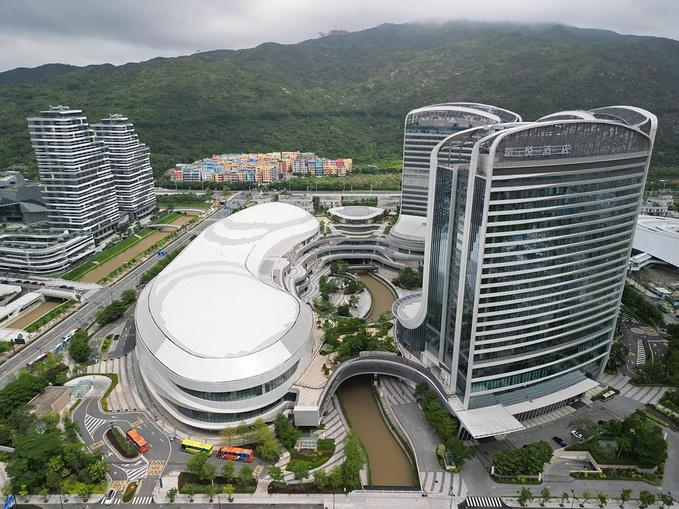

# 横琴丽新创新方旅游区

## 景点图片

> 图片来源：[去哪儿旅行](https://tr-osdcp.qunarzz.com/tr-osd-tr-space/img/f4360185ee96edc02e7f54a39cfb5e82.jpg_r_680x509x95_6ede7c2e.jpg)

## 基本信息

| 项目 | 内容 |
|------|------|
| 景点名称 | 横琴丽新创新方旅游区 |
| 所在城市 | 珠海市 |
| 所在区县 | 香洲区 |
| 景点级别 | 3A级景区 |
| 景点类型 | 主题乐园/文化创意 |
| 开放时间 | 10:00-20:00 |
| 门票价格 | 各项目单独收费，约80-200元/项目 |

## 景点介绍

横琴丽新创新方旅游区位于珠海市横琴粤澳深度合作区，是国家3A级旅游景区，由香港丽新集团投资打造的大型文化创意旅游综合体。创新方以"创意、科技、文化"为核心元素，融合电影、娱乐、购物、餐饮等多种业态，是横琴粤澳深度合作区最具代表性的文化旅游项目之一。

创新方旅游区由多个主题功能区组成，其中最受游客欢迎的是"狮门娱乐天地"——亚洲首座电影主题室内互动体验场馆。狮门娱乐天地以《饥饿游戏》《暮光之城》《分歧者》等好莱坞大片为蓝本，运用VR、AR、全息投影等先进科技，打造了多个沉浸式电影主题体验项目，让游客身临其境地感受电影世界的魅力。此外，创新方还设有"国家地理探险家中心"，将国家地理的探索精神与互动科技相结合，提供超过15种沉浸式互动体验。

除了娱乐体验项目，创新方旅游区还汇聚了众多国际品牌商店、特色餐饮和休闲设施。区内商业街区设计时尚，环境优美，适合游客休闲购物。创新方定期举办各类文化创意活动、主题展览和表演，为游客提供丰富多彩的游娱体验。旅游区内的酒店配套完善，为游客提供便利的住宿选择。

横琴丽新创新方旅游区是横琴粤澳深度合作区文旅产业的重要标杆项目，不仅丰富了珠海市的旅游产品供给，也为粤港澳大湾区居民提供了一个集娱乐、购物、餐饮于一体的综合性休闲度假目的地。旅游区紧邻横琴口岸，与澳门一桥之隔，交通极为便利。

## 景点特点

- **国家3A级景区**：横琴粤澳深度合作区代表性文化旅游项目
- **狮门娱乐天地**：亚洲首座电影主题室内互动体验场馆
- **国家地理探险家中心**：超过15种沉浸式互动体验项目
- **先进科技体验**：VR、AR、全息投影等技术打造沉浸式体验
- **商业配套完善**：国际品牌商店、特色餐饮、休闲设施齐全
- **地理位置优越**：紧邻横琴口岸，与澳门一桥之隔

## 位置

- **地址**：珠海市横琴粤澳深度合作区天羽道
- **经纬度**：22.138°N, 113.532°E

## 交通

- **公交**：珠海市内乘坐K10路、K11路、14路等公交至横琴口岸，再换乘接驳车或打车前往
- **自驾**：导航至"横琴创新方"，有停车场，珠海市区出发约40分钟车程
- **城轨**：可乘坐珠机城轨至横琴站，再换乘公交或打车前往

## 数据来源

- [创新方 - 百度百科](https://baike.baidu.com/item/%E5%88%9B%E6%96%B0%E6%96%B9)

## 最后更新时间

2026-07-19
