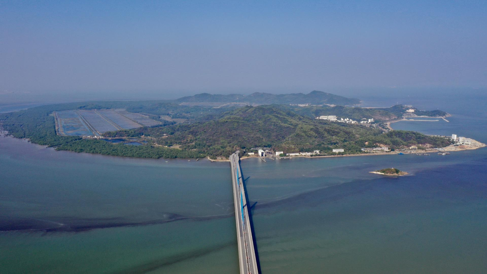

# 淇澳岛红树林

## 景点图片

> 图片来源：[Wikimedia Commons](https://commons.wikimedia.org/wiki/File:Qi%27ao_Island2021.jpg) · 许可证：CC BY-SA 4.0

## 基本信息

| 项目 | 内容 |
|------|------|
| 景点名称 | 淇澳岛红树林 |
| 所在城市 | 珠海市 |
| 所在区县 | 香洲区 |
| 景点级别 | 无 |
| 景点类型 | 自然保护区 |
| 开放时间 | 全天开放 |
| 门票价格 | 免费 |

## 景点介绍

淇澳岛红树林位于珠海市香洲区淇澳岛，面积约5000亩，是珠江三角洲地区面积最大的人工红树林。保护区内有红树林、白鹭、弹涂鱼等丰富的湿地生态资源。这里不仅是重要的生态屏障，也是科普教育基地。红树林根系发达，能有效防风消浪、净化水质，是海岸带重要的生态系统。每年秋冬季节，大量候鸟在此栖息，形成壮观的鸟类景观。

## 景点特点

1. **面积广阔**：约5000亩，是珠三角最大的人工红树林
2. **生态资源丰富**：有红树林、白鹭、弹涂鱼等丰富的湿地生态资源
3. **生态功能重要**：能有效防风消浪、净化水质
4. **科普教育基地**：是进行生态科普教育的重要场所
5. **观鸟胜地**：秋冬季节有大量候鸟栖息

## 位置

- **地址**：珠海市香洲区淇澳岛红树林自然保护区
- **经纬度**：22.417°N, 113.6471°E

## 交通

- **地铁**：无
- **公交**：珠海市区乘坐85路公交车至淇澳岛站
- **自驾**：从珠海市区出发，沿港湾大道向淇澳岛方向行驶，约30分钟车程

## 数据来源

## 最后更新时间

2026-06-25
