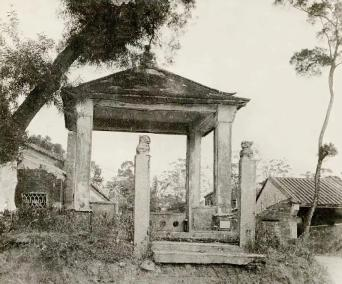

# 珠海中山纪念亭

## 景点图片

> 图片来源：[百度百科](https://bkimg.cdn.bcebos.com/smart/9d82d158ccbf6c81800af7ee1f67a63533fa828bea39-bkimg-process,v_1,rw_912,rh_756,maxl_342?x-bce-process=image/format,f_auto)

## 景点介绍

珠海中山纪念亭位于珠海市香洲区吉大九洲大道旁，是为纪念中国民主革命的伟大先行者孙中山先生而在珠海建立的重要历史纪念建筑。孙中山先生曾多次到访珠海，在这里传播革命思想、联络志士，为推翻封建帝制、建立民主共和国作出了重要贡献。中山纪念亭的建立，旨在铭记孙中山先生在珠海的革命足迹，传承和弘扬爱国主义精神。

纪念亭建筑风格庄重典雅，融合了中国传统亭台楼阁的建筑特色与近代西式建筑的简洁线条。亭内设有孙中山先生的铜像和生平事迹展板，详细记载了孙中山先生与珠海的不解之缘。亭周绿树环绕，环境清幽，是市民和游客瞻仰伟人风采、了解珠海革命历史的重要场所。

作为珠海市区内一处重要的历史文化地标，中山纪念亭不仅是爱国主义教育的生动教材，也是珠海市民缅怀革命先辈、传承红色基因的精神家园。每逢重大纪念日，这里都会举行各种纪念活动，吸引众多市民和游客前来参观瞻仰。

## 景点特点

- 纪念孙中山先生在珠海革命活动的重要历史遗迹
- 融合中国传统亭台与近代西式建筑风格
- 亭内设孙中山先生铜像和生平事迹展板
- 九洲大道旁，绿树环绕，环境清幽
- 爱国主义教育和红色文化传承的重要场所
- 重大纪念日举行各种纪念活动

## 位置

- **地址**：广东省珠海市香洲区吉大九洲大道中山纪念亭
- **经纬度**：22.2452°N, 113.5265°E

## 交通

- **公交**：珠海市内可乘坐9路、99路、68路、L1路等公交线路至纪念亭站
- **自驾**：沿九洲大道行驶即可到达，周边设有停车位

## 数据来源

- [百度百科-中山纪念亭](https://baike.baidu.com/item/%E4%B8%AD%E5%B1%B1%E7%BA%AA%E5%BF%B5%E4%BA%AD)

## 最后更新时间

2026-07-19

