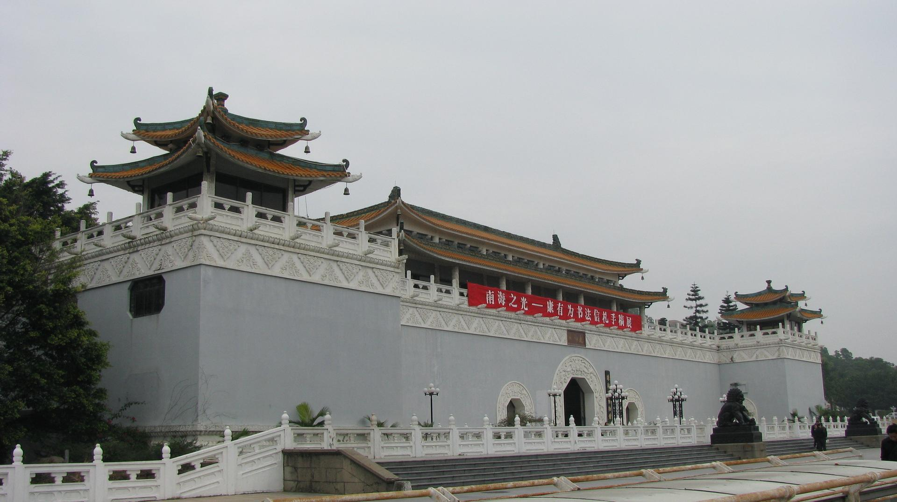

# 珠海博物馆

## 景点图片

> 图片来源：[Wikimedia Commons](https://commons.wikimedia.org/wiki/File:%E7%8F%A0%E6%B5%B7%E5%B8%82%E5%8D%9A%E7%89%A9%E9%A6%86_ZhuHai_Museum_-_panoramio.jpg) · 许可证：CC BY 4.0

## 基本信息

| 项目 | 内容 |
|------|------|
| 景点名称 | 珠海博物馆 |
| 所在城市 | 珠海市 |
| 所在区县 | 香洲区 |
| 景点级别 | - |
| 景点类型 | 博物馆 |
| 开放时间 | 09:00-17:00（16:30停止入馆，周一闭馆） |
| 门票价格 | 免费（需预约） |

## 景点介绍

珠海博物馆位于珠海市香洲区银桦路108号，是珠海市最大的综合性博物馆，也是珠海市重要的文化地标。博物馆成立于1985年，馆藏文物丰富，涵盖了珠海地区的历史、文化、民俗等多个方面，是了解珠海城市发展和岭南文化的重要窗口。

博物馆建筑面积约1.5万平方米，设有多个常设展厅和临时展厅。常设展厅包括"珠海历史"、"珠海民俗"、"珠海自然资源"等主题展览，通过大量珍贵文物、图片和多媒体展示，全面介绍了珠海从古代到现代的发展历程。馆内收藏有青铜器、陶瓷、书画等各类文物数千件，其中不乏国家级珍贵文物。

珠海博物馆不仅是文物收藏和展示的场所，也是开展社会教育和文化研究的重要机构。博物馆定期举办各类学术讲座、文化活动和临时展览，为市民和游客提供丰富多彩的文化体验。博物馆建筑本身也颇具特色，是珠海市区内重要的文化建筑之一。

## 景点特点

- 珠海市最大的综合性博物馆
- 馆藏文物丰富，涵盖珠海历史与文化
- 设有多个主题展厅
- 免费开放，定期举办文化活动
- 珠海市重要的文化地标

## 位置

- **地址**：珠海市香洲区银桦路108号
- **经纬度**：22.2778°N, 113.5597°E

## 交通

- **地铁**：可乘坐珠海地铁2号线至市民中心站
- **公交**：珠海市内可乘坐9路、18路、23路等公交线路至珠海博物馆站
- **自驾**：可从银桦路、人民西路等路线前往，博物馆设有停车场

## 数据来源

- [珠海博物馆官网](http://www.zhmuseum.com/)

## 最后更新时间

2026-06-20
