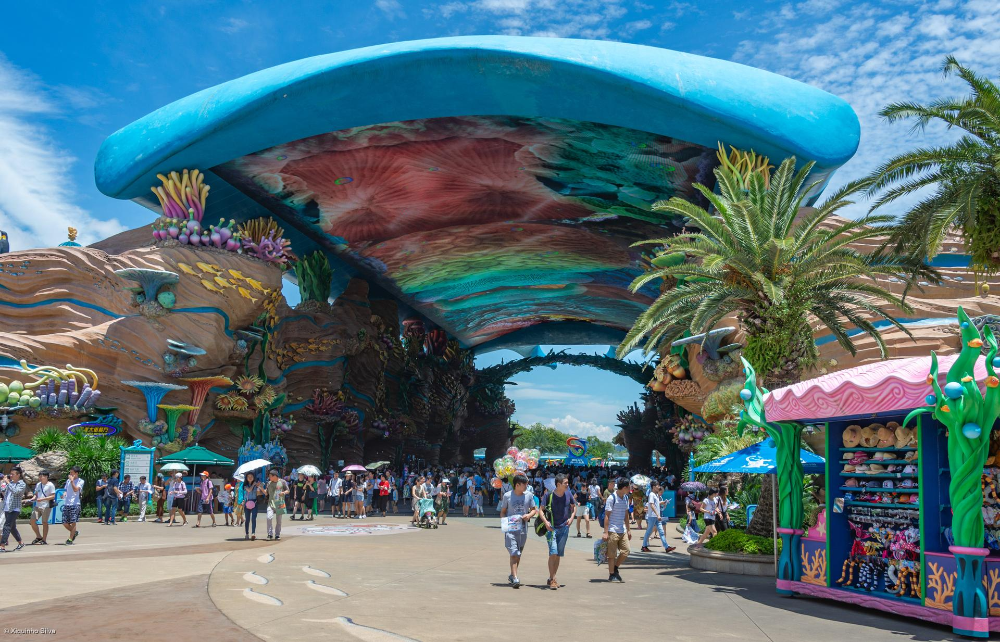

# 长隆海洋王国

## 景点图片

> 图片来源：[Wikimedia Commons](https://commons.wikimedia.org/wiki/File:Chimelong_Ocean_Kingdom_Avenue.jpg) · 许可证：CC BY 4.0

## 基本信息

| 项目 | 内容 |
|------|------|
| 景点名称 | 长隆海洋王国 |
| 所在城市 | 珠海市 |
| 所在区县 | 香洲区 |
| 景点级别 | 5A |
| 景点类型 | 主题公园 |
| 开放时间 | 10:00-21:00（具体时间以官方公告为准） |
| 门票价格 | 成人票约395元（具体价格以官方公告为准） |

## 景点介绍

长隆海洋王国是全球最大的海洋主题公园之一，位于珠海市香洲区横琴岛，是长隆集团在广东珠海打造的超大型综合性主题旅游度假区。公园以海洋为主题，集海洋动物展示、大型游乐设施、主题演艺表演于一体，是珠海乃至粤港澳大湾区最受欢迎的旅游目的地之一。

园区内拥有多个特色主题区域，包括海洋大街、海豚岛、海洋奇观、极地探险等。其中，海洋奇观拥有世界最大的水族馆之一，饲养了包括鲸鲨、白鲸、海豚等在内的数百种海洋生物。此外，公园内还设有多个大型游乐设施，如过山车、水上乐园等，适合不同年龄段的游客体验。

长隆海洋王国每年接待游客数百万人次，是珠海市的标志性旅游景点。园区定期举办各种节庆活动和夜间灯光秀，为游客提供丰富的游玩体验。公园交通便利，是家庭亲子游和朋友聚会的理想去处。

## 景点特点

- 全球最大海洋主题公园之一
- 拥有世界最大水族馆之一
- 丰富的海洋动物展示与互动体验
- 多种大型游乐设施与主题演艺
- 适合全年龄段游客

## 位置

- **地址**：珠海市香洲区横琴岛富祥湾长隆旅游度假区
- **经纬度**：22.0998°N, 113.5364°E

## 交通

- **地铁**：暂无直达地铁，可乘坐公交或自驾前往
- **公交**：珠海市内可乘坐K11、K10、14路等公交线路至长隆站
- **自驾**：可从广珠西线高速、港珠澳大桥等路线前往，园区设有大型停车场

## 数据来源

- [长隆海洋王国官网](https://www.chimelong.com/zh/oceankingdom/)

## 最后更新时间

2026-06-20
