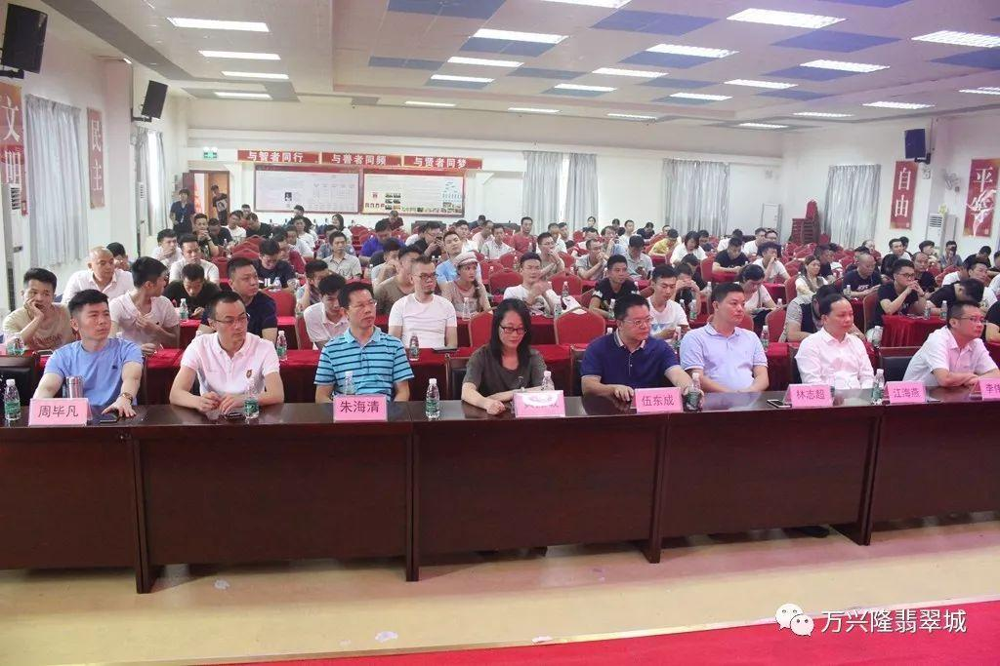

# 四会LIVE直播基地

## 景点图片

> 图片来源：[搜狐网](http://5b0988e595225.cdn.sohucs.com/images/20190827/32033e88068e445a83b9a20becf1ba7d.jpeg)

## 基本信息

| 项目 | 内容 |
|------|------|
| 景点名称 | 四会LIVE直播基地景区 |
| 所在城市 | 肇庆市 |
| 所在区县 | 四会市 |
| 景点级别 | 3A级景区 |
| 景点类型 | 购物/文化 |
| 开放时间 | 09:00-21:00 |
| 门票价格 | 免费 |

## 景点介绍

四会LIVE直播基地位于肇庆市四会市，是依托四会玉器产业打造的特色玉器直播电商基地。近年来，四会市积极拥抱数字经济，将传统玉器产业与直播电商新模式深度融合，建成了以玉器直播销售为核心的专业直播基地。

基地内设有多个专业直播间、玉器展示区、物流配送中心等功能区域，汇聚了大量玉器商家和直播主播。游客可以参观直播现场，了解玉器直播电商的运作模式，感受"互联网+玉器"的产业新业态。四会LIVE直播基地不仅是玉器销售的新平台，也成为了四会市工业旅游和商贸旅游的新亮点。

## 景点特点

- **直播电商**：专业玉器直播电商基地，展示新零售模式
- **玉器产业**：依托四会玉器产业优势，品种丰富
- **互动体验**：可参观直播现场，了解直播带货全过程
- **数字经济**：体现传统产业与数字经济的融合
- **免费开放**：对公众免费开放，感受电商新业态

## 位置

- **地址**：肇庆市四会市四会LIVE直播基地
- **经纬度**：23.3200°N, 112.6900°E

## 交通

- **地铁**：无
- **公交**：乘坐四会市内公交至玉器商圈站
- **自驾**：从肇庆市区出发，沿G321国道转S260省道，约50分钟车程

## 数据来源

- [四会市人民政府](https://www.sihui.gov.cn/)

## 最后更新时间

2026-07-19

