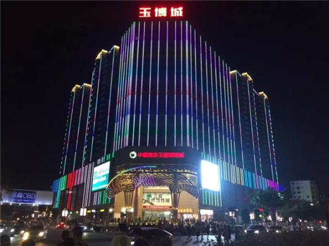

# 广东四会玉器博览城

## 景点图片

> 图片来源：[百度百科](https://bkimg.cdn.bcebos.com/pic/91529822720e0cf3d7ca1e07c80ce51fbe096a637cbe?x-bce-process=image/resize,m_lfit,w_536,limit_1/format,f_jpg)

## 基本信息

| 项目 | 内容 |
|------|------|
| 景点名称 | 广东四会玉器博览城 |
| 所在城市 | 肇庆市 |
| 所在区县 | 四会市 |
| 景点级别 | 3A级景区 |
| 景点类型 | 购物/文化 |
| 开放时间 | 09:00-18:00 |
| 门票价格 | 免费 |

## 景点介绍

广东四会玉器博览城位于肇庆市四会市，是中国最大的玉器交易市场之一。四会素有"中国玉器之乡"的美誉，玉器产业历史悠久，玉器博览城集玉器展示、交易、加工、文化传播于一体，是四会玉器产业的重要窗口和标志性建筑。

博览城内设有大型玉器交易大厅、精品展示区、大师工作室、玉文化博物馆等功能区域，汇聚了来自全国各地的玉雕大师作品和玉器精品。游客在这里不仅可以欣赏到精美的玉器作品，还能近距离观看玉器加工制作过程，深入了解中国玉文化的博大精深。

## 景点特点

- **中国玉器之乡**：四会是中国重要的玉器加工和交易基地
- **规模宏大**：中国最大的玉器交易市场之一
- **精品荟萃**：汇集各类玉器精品和大师作品
- **文化体验**：展示玉文化历史和发展
- **购物天堂**：品种齐全，价格实惠，是购买玉器首选之地

## 位置

- **地址**：肇庆市四会市玉器博览城
- **经纬度**：23.3300°N, 112.7000°E

## 交通

- **地铁**：无
- **公交**：乘坐四会市内公交至玉器博览城站
- **自驾**：从肇庆市区出发，沿G321国道转S260省道，约50分钟车程

## 数据来源

- [百度百科-四会玉器](https://baike.baidu.com/item/%E5%9B%9B%E4%BC%9A%E7%8E%89%E5%99%A8)
- [四会市人民政府](https://www.sihui.gov.cn/)

## 最后更新时间

2026-07-19

