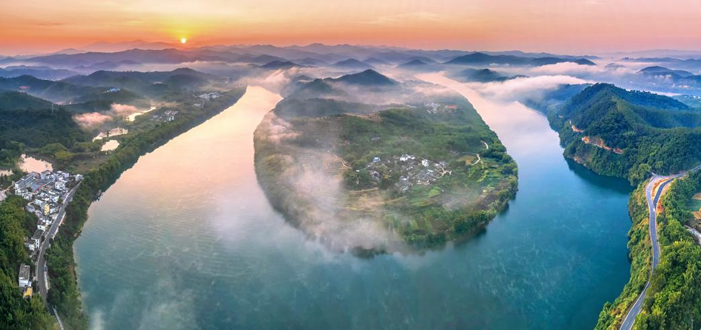

# 贺江碧道画廊景区

## 景点图片

> 图片来源：[新浪网](https://n.sinaimg.cn/spider20220919/733/w1042h491/20220919/6eef-3e6f08a4eaa6669f1b754703c6f9269a.png)

## 基本信息

| 项目 | 内容 |
|------|------|
| 景点名称 | 贺江碧道画廊景区 |
| 所在城市 | 肇庆市 |
| 所在区县 | 封开县 |
| 景点级别 | 4A级 |
| 景点类型 | 自然风光 |
| 开放时间 | 全天开放 |
| 门票价格 | 免费 |

## 景点介绍

贺江碧道画廊位于广东省肇庆市封开县，是沿贺江两岸打造的生态旅游画廊，全长约30公里。景区依托贺江优美的自然风光和丰富的生态资源，融合了碧道骑行、滨水观光、乡村体验等多种旅游元素，被誉为"广东最美碧道"之一。贺江水清岸绿，两岸青山叠翠，田园村落点缀其间，形成了一幅"水清岸绿、鱼翔浅底"的生态画卷。

## 景点特点

- **碧道骑行**：景区沿贺江建有完善的碧道骑行系统，游客可骑行或漫步于江畔，欣赏贺江两岸的秀美风光，感受自然与人文的和谐共生。
- **水上观光**：贺江碧道画廊提供游船观光服务，游客可乘船沿江而下，从水上视角欣赏两岸青山、田园、村落组成的山水画卷。
- **生态景观**：贺江水质清澈，两岸植被茂密，白鹭翔集，是观鸟和生态摄影的绝佳场所，四季景色各异，春有花海、夏有绿荫、秋有红叶、冬有暖阳。
- **乡村体验**：沿途分布着多个特色村落，游客可体验封开县的乡村生活、品尝当地农家美食，感受浓郁的岭南乡土气息。
- **摄影胜地**：贺江碧道画廊是摄影爱好者的天堂，清晨江雾、傍晚霞光、江中倒影，构成了一幅幅动人的山水画卷。

## 位置

- **地址**：广东省肇庆市封开县贺江碧道画廊景区
- **经纬度**：23.4500°N, 111.5200°E

## 交通

- **自驾**：导航搜索"封开贺江碧道画廊"，经广佛肇高速至封开出口下，沿指示牌行驶即可到达

## 数据来源

- [肇庆市文化广电旅游体育局](https://www.zhaoqing.gov.cn/zfxxgk/xxgkml/whgdlytyj/)
- [封开县人民政府官网](https://www.fengkai.gov.cn/)

## 最后更新时间

2026-07-19

