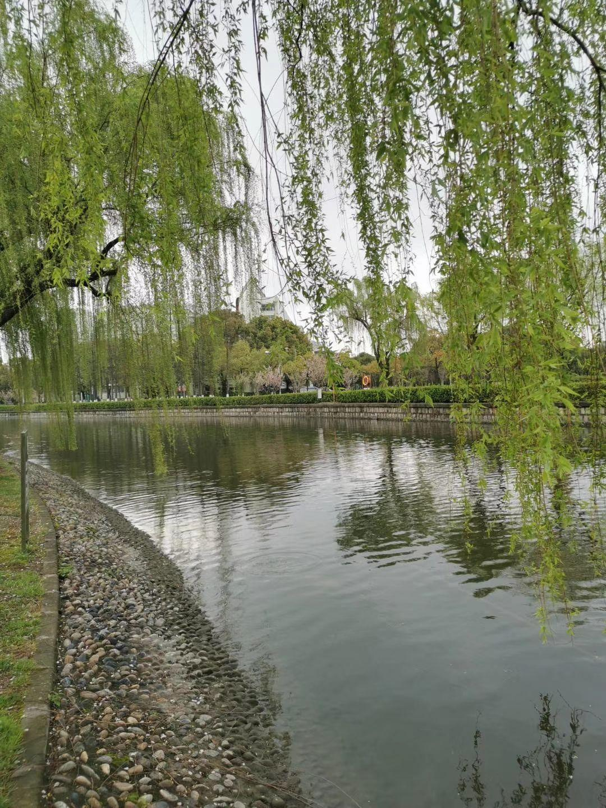

# 油茶文化博览园景区

## 景点图片

> 图片来源：[携程攻略](https://youimg1.c-ctrip.com/target/100o1f000001g4awq2858.jpg)

## 基本信息

| 项目 | 内容 |
|------|------|
| 景点名称 | 油茶文化博览园景区 |
| 所在城市 | 肇庆市 |
| 所在区县 | 广宁县 |
| 景点级别 | 3A级 |
| 景点类型 | 农业观光 |
| 开放时间 | 08:30-17:30 |
| 门票价格 | 免费 |

## 景点介绍

油茶文化博览园位于广东省肇庆市广宁县，是以油茶种植、加工和茶油文化展示为主题的农业观光旅游景区。广宁县是广东省重要的油茶产区，油茶种植历史悠久，油茶产业是当地农业的支柱产业之一。博览园依托广宁县丰富的油茶资源，打造了集油茶种植示范、茶油加工展示、茶油文化博览、休闲观光于一体的综合性旅游景区。

## 景点特点

- **油茶种植示范**：园区拥有大面积的油茶种植示范基地，游客可近距离观赏油茶树的生长过程，了解油茶的种植技术和管理方法，每年油茶花盛开时节，漫山遍野的白色茶花景色壮观。
- **茶油加工展示**：景区设有茶油加工展示车间，展示了从油茶果采摘、晾晒、压榨到精炼成茶油的全过程，让游客了解传统压榨和现代精炼工艺的区别。
- **茶油文化博览**：园区内设有茶油文化展览馆，展示了中国茶油文化的发展历史、广宁油茶产业的变迁以及茶油的营养价值与健康功效。
- **产品体验**：游客可品尝和购买各类茶油及其衍生产品，如食用茶油、护肤品、保健品等，感受茶油的独特魅力。

## 位置

- **地址**：广东省肇庆市广宁县油茶文化博览园
- **经纬度**：23.5900°N, 112.4100°E

## 交通

- **自驾**：导航搜索"广宁油茶文化博览园"，经二广高速至广宁出口下，沿指示牌行驶即可到达

## 数据来源

- [广宁县人民政府官网](https://www.gdgn.gov.cn/)

## 最后更新时间

2026-07-19

