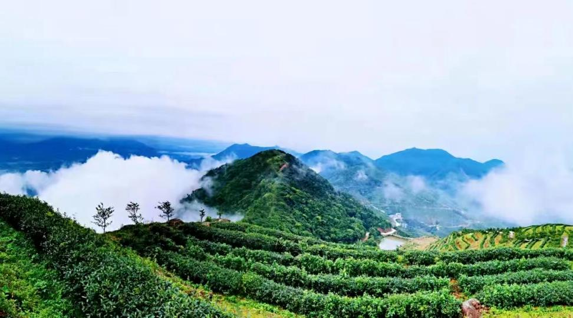

# 巢顶山茶业公园景区

## 景点图片

> 图片来源：[新浪网](https://n.sinaimg.cn/spider20230410/712/w972h540/20230410/a88e-fe3396d8a985f5837bff39fd68ad40fe.png)

## 基本信息

| 项目 | 内容 |
|------|------|
| 景点名称 | 巢顶山茶业公园景区 |
| 所在城市 | 肇庆市 |
| 所在区县 | 德庆县 |
| 景点级别 | 3A级 |
| 景点类型 | 生态农业 |
| 开放时间 | 08:30-17:30 |
| 门票价格 | 免费 |

## 景点介绍

巢顶山茶业公园位于广东省肇庆市德庆县，是集茶叶种植、加工、观光、休闲度假于一体的生态茶园景区。公园依托巢顶山优越的自然生态环境，以茶文化为主题，打造了千亩生态茶园景观。游客在这里可以欣赏连绵起伏的茶山风光，体验采茶、制茶的乐趣，感受浓厚的茶文化氛围。

## 景点特点

- **生态茶园景观**：巢顶山茶业公园拥有千亩生态茶园，茶树依山而种，层层叠叠，绿意盎然，形成壮观的梯田茶山景观，四季皆可观赏。
- **茶文化体验**：景区设有茶叶加工展示车间和茶文化体验馆，游客可亲手参与采茶、制茶过程，了解茶叶从采摘到成品的完整工艺流程。
- **品茶休闲**：景区内设有茶艺馆和观景平台，游客可品茗赏景，感受茶香与山景交融的惬意时光。
- **自然生态**：巢顶山植被茂密，空气清新，负氧离子含量高，是休闲养生、亲近自然的理想去处。

## 位置

- **地址**：广东省肇庆市德庆县巢顶山茶业公园
- **经纬度**：23.2000°N, 111.9000°E

## 交通

- **自驾**：导航搜索"德庆巢顶山茶业公园"，经广昆高速至德庆出口下，沿县道行驶至巢顶山即可到达

## 数据来源

- [德庆县人民政府官网](https://www.gddq.gov.cn/)

## 最后更新时间

2026-07-19

