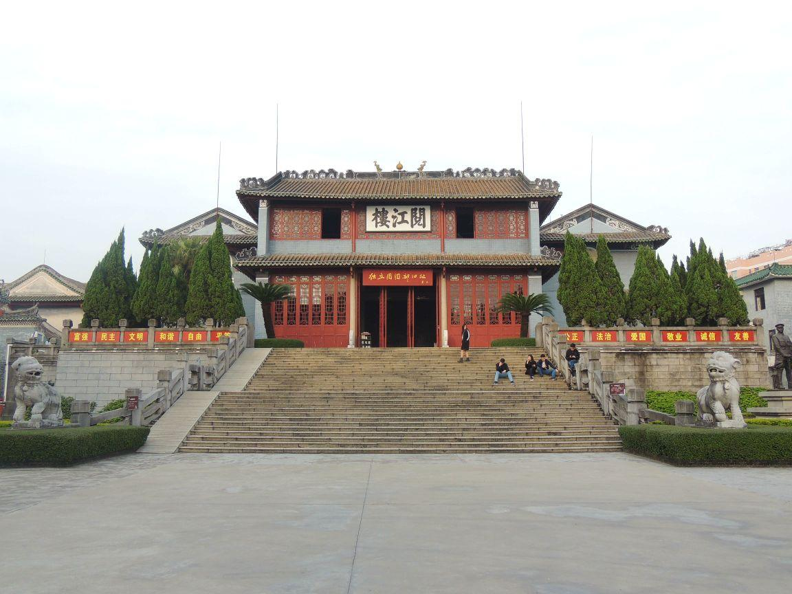

# 宿安红色景区

## 景点图片

> 图片来源：[携程攻略](https://youimg1.c-ctrip.com/target/100q0n000000e4jobC5B8.jpg)

## 基本信息

| 项目 | 内容 |
|------|------|
| 景点名称 | 宿安红色景区 |
| 所在城市 | 肇庆市 |
| 所在区县 | 怀集县 |
| 景点级别 | 3A级景区 |
| 景点类型 | 红色旅游 |
| 开放时间 | 08:30-17:30 |
| 门票价格 | 免费 |

## 景点介绍

宿安红色景区位于肇庆市怀集县，是怀集县重要的红色革命教育基地。景区以宿安村为核心，依托丰富的红色革命历史资源，打造了集革命遗址参观、红色文化教育、爱国主义教育于一体的红色旅游景点。

景区内保存有革命旧址、烈士纪念碑、红色文化展览馆等重要历史遗迹和纪念设施，通过图片、实物、场景复原等多种形式，生动再现了革命先辈在怀集地区的英勇斗争历史。宿安红色景区是开展党史学习教育、传承红色基因的重要阵地，每年吸引大量党员干部、学生和游客前来参观学习。

## 景点特点

- **红色教育**：重要的红色革命教育基地
- **革命遗址**：保存有革命旧址和烈士纪念碑
- **文化展览**：红色文化展览馆展示革命历史
- **爱国主义教育**：开展爱国主义教育的重要场所
- **免费开放**：对公众免费开放

## 位置

- **地址**：肇庆市怀集县宿安红色景区
- **经纬度**：23.8600°N, 112.1400°E

## 交通

- **地铁**：无
- **公交**：怀集县城乘坐前往宿安方向的班车
- **自驾**：从怀集县城出发，沿S349省道行驶，约30分钟车程

## 数据来源

- [怀集县人民政府](https://www.huaiji.gov.cn/)

## 最后更新时间

2026-07-19

