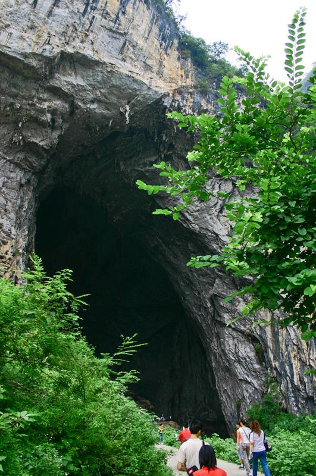

# 怀集燕岩

## 景点图片

> 图片来源：[Wikimedia Commons](https://commons.wikimedia.org/wiki/File:%E8%82%87%E5%BA%86%E6%80%80%E9%9B%86%E7%87%95%E5%B2%A9%20-%20panoramio.jpg) · 许可证：CC BY-SA 4.0

## 基本信息

| 项目 | 内容 |
|------|------|
| 景点名称 | 怀集燕岩 |
| 所在城市 | 肇庆市 |
| 所在区县 | 怀集县 |
| 景点级别 | 无 |
| 景点类型 | 自然风景区 |
| 开放时间 | 08:00-17:30 |
| 门票价格 | 约60元 |

## 景点介绍

怀集燕岩位于肇庆市怀集县桥头镇，是一个大型石灰岩溶洞，因每年有数十万只金丝燕在此栖息而得名。洞内有地下河、钟乳石等景观，每年农历六月初六前后是观赏燕子的最佳时节。燕岩洞高约66米，宽约40米，深约600米，是典型的喀斯特地貌溶洞。洞内钟乳石千姿百态，与飞舞的燕子相映成趣，形成独特的自然景观。

## 景点特点

1. **燕子奇观**：每年有数十万只金丝燕在此栖息，形成壮观景象
2. **溶洞景观**：洞内有地下河、钟乳石等喀斯特地貌景观
3. **最佳观赏期**：农历六月初六前后是观赏燕子的最佳时节
4. **规模宏大**：洞高66米，宽40米，深600米
5. **生态环境好**：是金丝燕重要的栖息地和繁殖地

## 位置

- **地址**：肇庆市怀集县桥头镇燕岩风景区
- **经纬度**：23.7551°N, 111.9616°E

## 交通

- **地铁**：无
- **公交**：怀集县城乘坐前往桥头镇的班车
- **自驾**：从怀集县城出发，沿S265省道向桥头镇方向行驶，约40分钟车程

## 数据来源

- [百度百科-燕岩风景区](https://baike.baidu.com/item/%E7%87%95%E5%B2%A9%E9%A3%8E%E6%99%AF%E5%8C%BA/2660894)

## 最后更新时间

2026-06-25
