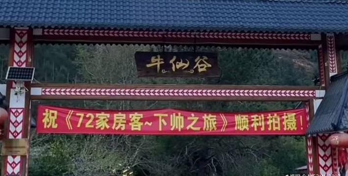

# 红霞湾牛仙谷景区

## 景点图片

> 图片来源：[去哪儿旅行](https://qimgs.qunarzz.com/piao_qsight_provider_piao_qsight_web/0106d12000azmaowtD0B2_C_900_504.jpg_710x360_dd546db7.jpg)

## 基本信息

| 项目 | 内容 |
|------|------|
| 景点名称 | 红霞湾牛仙谷景区 |
| 所在城市 | 肇庆市 |
| 所在区县 | 怀集县 |
| 景点级别 | 3A级景区 |
| 景点类型 | 自然风景区 |
| 开放时间 | 08:00-17:30 |
| 门票价格 | 约30元/人 |

## 景点介绍

红霞湾牛仙谷位于肇庆市怀集县，是一处以自然山水风光为主题的生态旅游景区。景区因红霞映照山湾、山谷形似卧牛而得名，山水相依，景色秀丽，是大自然鬼斧神工的杰作。

景区内溪流蜿蜒，瀑布飞溅，奇石林立，植被丰茂。游客可以沿着山谷步道漫步，欣赏沿途的山水美景，感受大自然的宁静与壮美。牛仙谷中还有多处天然潭水，水质清澈见底，夏日时节是戏水消暑的好去处。红霞湾的日落景观尤为著名，每当夕阳西下，霞光映照山湾，景色美不胜收。

## 景点特点

- **山水风光**：溪流、瀑布、奇石，自然景观丰富
- **红霞景观**：日落时分霞光映照，景色壮美
- **天然潭水**：水质清澈，夏日戏水消暑胜地
- **生态步道**：沿山谷修建步道，适合徒步观光
- **生态环境**：植被丰茂，空气清新

## 位置

- **地址**：肇庆市怀集县红霞湾牛仙谷景区
- **经纬度**：23.8500°N, 112.1200°E

## 交通

- **地铁**：无
- **公交**：怀集县城乘坐前往红霞湾方向的班车
- **自驾**：从怀集县城出发，沿S265省道行驶，约30分钟车程

## 数据来源

- [怀集县人民政府](https://www.huaiji.gov.cn/)

## 最后更新时间

2026-07-19

