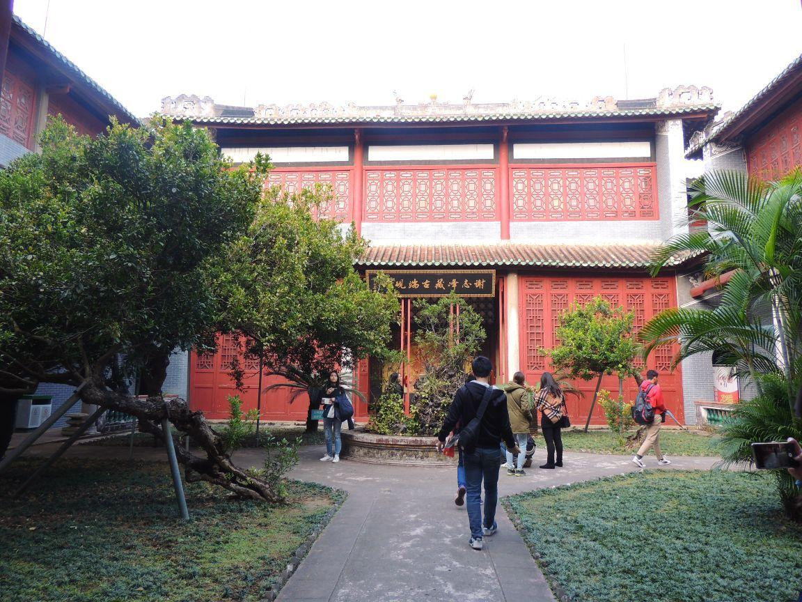

# 肇庆阅江楼

## 景点图片

> 图片来源：[携程攻略](https://youimg1.c-ctrip.com/target/100r0n000000e1sep8604.jpg)

## 景点特点

- **叶挺独立团诞生地**：1925年叶挺独立团在此成立，具有重大革命历史意义
- **明代古建筑**：始建于明代的崧台书院，建筑风格古朴典雅
- **爱国主义教育基地**：全国爱国主义教育示范基地，适合开展红色教育
- **西江景观**：面临西江，登楼可眺望西江美景
- **免费开放**：对公众免费开放

## 位置

- **地址**：广东省肇庆市端州区阅江路阅江楼
- **经纬度**：23.0438°N, 112.4705°E

## 交通

- **公交**：肇庆市区乘坐公交车至阅江楼站下车
- **自驾**：导航至"肇庆阅江楼"，市区内交通便利

## 数据来源

- [百度百科-肇庆市](https://baike.baidu.com/item/%E8%82%87%E5%BA%86%E5%B8%82)
- [广东省文化和旅游厅](https://whly.gd.gov.cn/)

## 最后更新时间

2026-07-19

