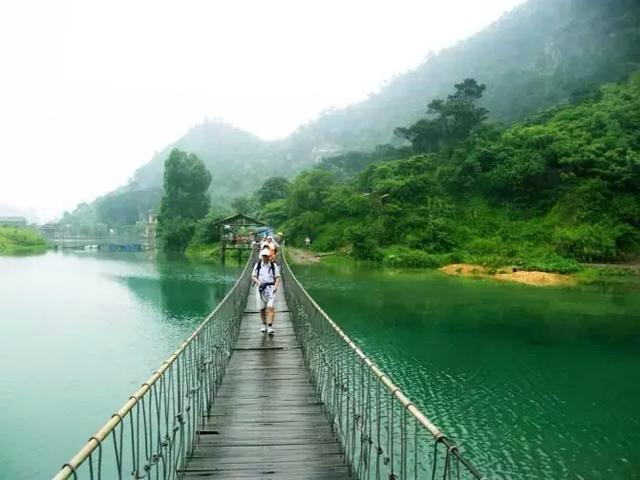

# 紫云谷

## 景点图片

> 图片来源：[携程攻略](https://youimg1.c-ctrip.com/target/100w0u000000jl2mr138B.jpg)

## 景点特点

- **端砚文化发源地**：盛产优质端砚石料，砚坑遗址众多
- **峡谷风光**：溪流瀑布，森林茂密，号称"岭南九寨沟"
- **生态环境优良**：负离子含量高，是天然氧吧
- **户外活动丰富**：溯溪、徒步、森林探险等项目多样
- **端砚文化展示**：了解端砚历史和制作工艺

## 位置

- **地址**：广东省肇庆市高要区金渡镇紫云谷
- **经纬度**：23.1323°N, 112.5814°E

## 交通

- **自驾**：肇庆市区出发，沿G80广昆高速至金渡出口下，按指示牌前往
- **渡船**：在肇庆西江码头乘坐渡船至紫云谷码头

## 数据来源

- [百度百科-肇庆市](https://baike.baidu.com/item/%E8%82%87%E5%BA%86%E5%B8%82)
- [高要区人民政府](https://www.gaoyao.gov.cn/)

## 最后更新时间

2026-07-19
