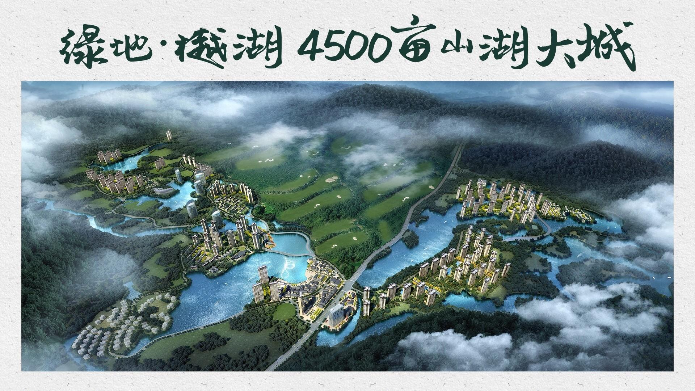

# 绿地樾湖生态园

## 景点图片

> 图片来源：[static.loupan.com](https://static.loupan.com/upfile2/image/20180806/20180806182237_4712206.jpg)

## 基本信息

| 项目 | 内容 |
|------|------|
| 景点名称 | 绿地樾湖生态园景区 |
| 所在城市 | 肇庆市 |
| 所在区县 | 高要区 |
| 景点级别 | 3A级景区 |
| 景点类型 | 生态景区 |
| 开放时间 | 08:30-17:30 |
| 门票价格 | 免费 |

## 景点介绍

绿地樾湖生态园位于肇庆市高要区，是集生态观光、休闲度假、户外运动于一体的综合性生态旅游景区。景区依托樾湖水域和周边山水资源，打造了优美的湖光山色景观，是肇庆市民和游客休闲度假的理想去处。

景区内湖面宽阔，水质清澈，四周青山环绕，绿树成荫。景区设有环湖步道、观景平台、亲水平台等设施，游客可以漫步湖畔，欣赏湖光山色，感受大自然的宁静与美好。此外，景区还提供垂钓、划船等水上休闲项目，以及露营、烧烤等户外活动，适合家庭出游和团队活动。

## 景点特点

- **湖光山色**：依托樾湖水域，湖面宽阔，山水相映成趣
- **生态休闲**：集生态观光、休闲度假于一体
- **户外活动**：提供垂钓、划船、露营、烧烤等多种项目
- **免费开放**：对公众免费开放，是市民休闲的好去处
- **环境优美**：空气清新，适合亲近自然

## 位置

- **地址**：广东省肇庆市高要区绿地樾湖生态园
- **经纬度**：23.0100°N, 112.5400°E

## 交通

- **自驾**：肇庆市区出发，沿G80广昆高速至高要出口下，按指示牌前往
- **公交**：高要区内乘坐公交车至樾湖生态园站下车

## 数据来源

- [肇庆市文化广电旅游体育局](https://www.zhaoqing.gov.cn/zfxxgk/xxgkml/whgdlytyj/)
- [高要区人民政府](https://www.gaoyao.gov.cn/)

## 最后更新时间

2026-07-19

