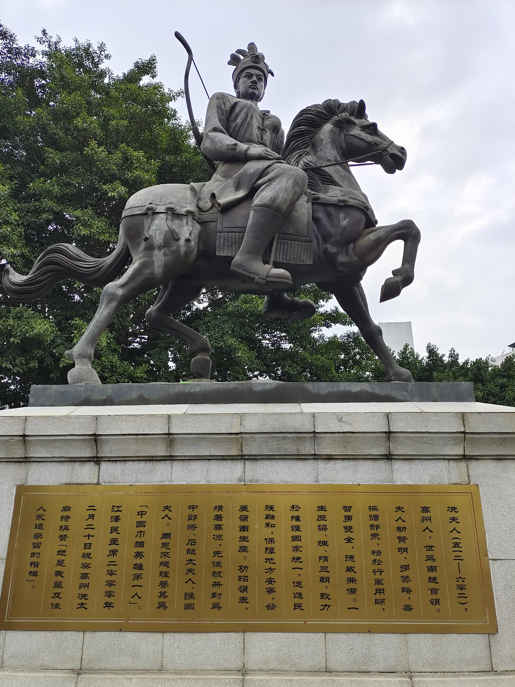

# 高州冼太庙

## 景点图片

> 图片来源：[Wikimedia Commons](https://commons.wikimedia.org/wiki/File:Xian_Fu_Ren_statue.jpg) · 许可证：CC BY-SA 4.0

## 基本信息

| 项目 | 内容 |
|------|------|
| 景点名称 | 高州冼太庙 |
| 所在城市 | 茂名市 |
| 所在区县 | 高州市 |
| 景点级别 | 全国重点文物保护单位 |
| 景点类型 | 历史建筑/宗教寺庙 |
| 开放时间 | 08:00-17:30 |
| 门票价格 | 免费 |

## 景点介绍

高州冼太庙位于茂名市高州市，是为纪念岭南圣母冼夫人而建的庙宇，始建于隋代，至今已有1400多年的历史，是全国重点文物保护单位。冼夫人是岭南地区著名的女政治家和军事家，被尊为"岭南圣母"。

高州冼太庙占地面积约3000多平方米，由前殿、中殿、后殿三进组成，建筑风格融合了岭南传统建筑特色。庙内保存有大量珍贵的碑刻和历史文物，包括隋代的冼夫人铜像、唐代的石刻等。

冼夫人文化是茂名地区最重要的文化遗产之一。每年农历十一月二十四日冼夫人诞辰期间，高州冼太庙都会举办盛大的庙会活动，吸引数十万信众前来朝拜。

## 景点特点

- **纪念冼夫人**：岭南圣母，著名的女政治家和军事家
- **1400年历史**：始建于隋代，全国重点文物保护单位
- **三进院落**：前殿、中殿、后殿组成
- **珍贵文物**：隋代冼夫人铜像、唐代石刻等
- **冼夫人文化**：茂名地区最重要的文化遗产

## 位置

- **地址**：茂名市高州市冼太路
- **经纬度**：21.917°N, 110.8575°E

## 交通

- **自驾**：茂名市区出发约40分钟车程
- **公交**：高州市内多路公交可达

## 数据来源

- [百度百科-高州冼太庙](https://baike.baidu.com/item/高州冼太庙)

## 最后更新时间

2026-06-20
