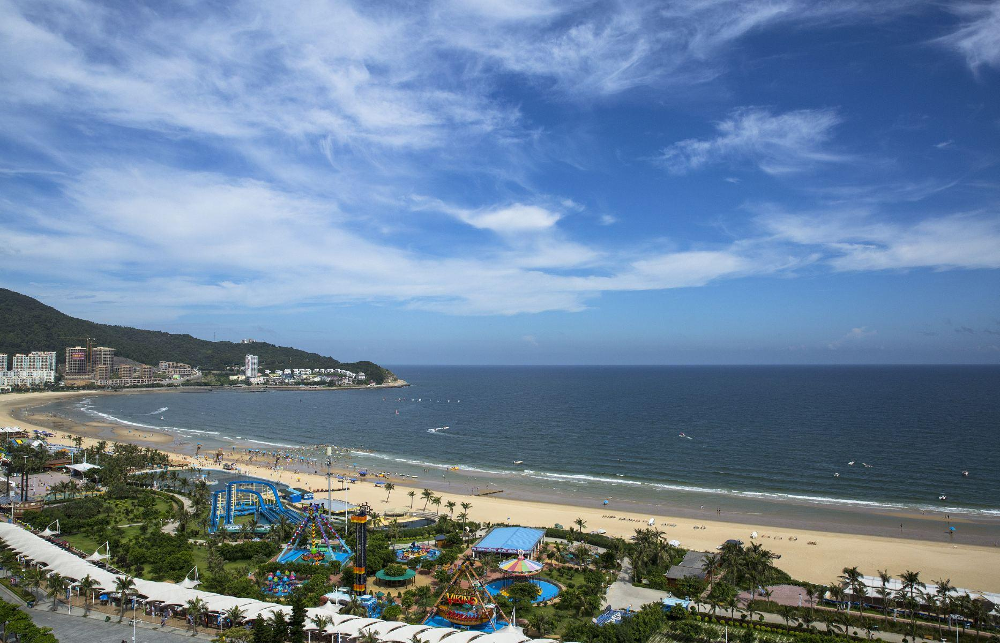

# 大角湾

## 景点图片

> 图片来源：[携程攻略](https://you.ctrip.com/sight/yangjiang100044/142728.html)

## 基本信息

| 项目 | 详情 |
|------|------|
| 景点名称 | 大角湾 |
| 所在地区 | 阳江市江城区 |
| 景点类型 | 海滨 |
| 景点等级 | 4A级旅游景区 |
| 开放时间 | 08:00-19:00 |
| 门票价格 | 50元（旺季） |
| 建议游玩时间 | 3-4小时 |
| 适合人群 | 家庭出游、情侣、水上运动爱好者 |

## 景点介绍

大角湾位于阳江市江城区海陵岛西南部，是海陵岛最著名的海滩浴场，因其海湾形似牛角而得名。大角湾沙滩长达2.5公里，沙质细腻柔软，海水清澈湛蓝，是海陵岛5A级旅游景区的重要组成部分。这里不仅是优质的海水浴场，还拥有丰富的水上娱乐项目，包括摩托艇、香蕉船、海上拖伞等，是华南地区最受欢迎的滨海度假目的地之一。大角湾景区设施完善，周边配套有餐饮、住宿、购物等综合服务，每年吸引大量游客前来休闲度假。

## 景点特点

- 海湾形似牛角，沙滩绵长，沙质细腻柔软
- 海水清澈湛蓝，是优质的海水浴场
- 丰富的水上娱乐项目，适合各类水上运动
- 景区设施完善，配套餐饮住宿齐全
- 海陵岛5A级景区的核心景点之一

## 位置

- **地址**：广东省阳江市江城区海陵岛闸坡镇大角湾海滨浴场
- **经纬度**：21.5673°N, 111.8425°E

## 交通

- **自驾**：从阳江市区出发，经海陵大桥至海陵岛，沿旅游大道直达大角湾
- **公交**：阳江市区可乘坐海陵岛旅游专线至大角湾站
- **高铁**：至阳江站后换乘公交或包车前往

## 数据来源

- [携程攻略：阳江海陵岛大角湾海上丝路旅游区](https://you.ctrip.com/sight/yangjiang363/23017.html)

## 最后更新时间

2026-07-19
