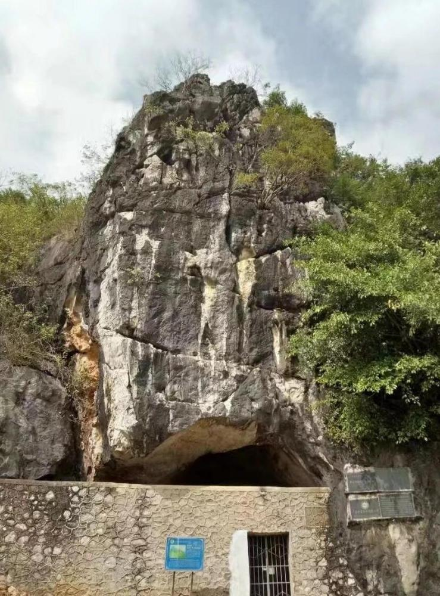

# 独石仔洞穴遗址

## 景点图片

> 图片来源：[百度百科](https://bkimg.cdn.bcebos.com/pic/ac345982b2b7d0a20cf4857068b761094b36adaf2c9f?x-bce-process=image/format,f_auto/resize,m_lfit,limit_1,h_1000)

## 基本信息

| 项目 | 内容 |
|------|------|
| 景点名称 | 独石仔洞穴遗址 |
| 所在城市 | 阳江市 |
| 所在区县 | 阳春市 |
| 景点级别 | 全国重点文物保护单位 |
| 景点类型 | 旧石器时代洞穴遗址 |
| 开放时间 | 以属地文物保护管理要求为准 |
| 门票价格 | 以现场公示为准 |

## 景点介绍

独石仔洞穴遗址位于阳春市陂面镇，是一处旧石器时代洞穴遗址。遗址出土的石器、骨器和动物化石等遗物，为研究岭南地区史前人类活动及其生存环境提供了重要实物资料。2001 年，国务院将其公布为第五批全国重点文物保护单位。

## 景点特点

- 属于岭南地区重要的史前洞穴遗址，具有较高的考古与历史研究价值。
- 遗址文化堆积和出土遗物反映了史前人类在粤西地区的生产生活状况。
- 文物遗址以保护为首要原则，参观前宜先确认属地开放及管理安排。

## 位置

- **地址**：广东省阳江市阳春市陂面镇六村岗独石山
- **经纬度**：22.355887°N, 111.882196°E

## 交通

- **地铁**：阳江市暂无地铁线路。
- **公交**：可先到达阳春市区，再查询前往陂面镇方向的城乡公交；末段交通及遗址开放情况请提前向属地管理部门确认。
- **自驾**：从阳春市区沿道路前往陂面镇，具体路线以实时导航和文物保护管理要求为准。

## 数据来源

- [国务院关于公布第五批全国重点文物保护单位和与现有全国重点文物保护单位合并项目的通知（中国政府网）](https://www.gov.cn/gongbao/content/2001/content_60955.htm)

## 最后更新时间

2026-07-19

