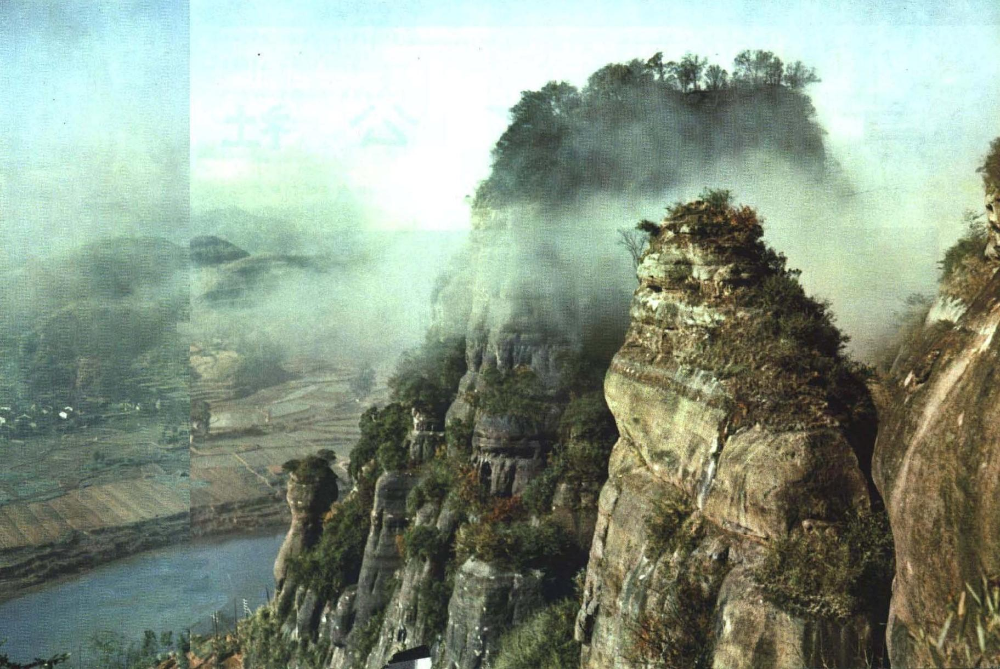

# 金鸡岭

## 景点图片

> 图片来源：[Wikimedia Commons](https://commons.wikimedia.org/wiki/File:1964-04_1964%E5%B9%B4_%E9%87%91%E9%B8%A1%E5%B2%AD.jpg) · 许可证：CC BY-SA 4.0

## 基本信息

| 项目 | 内容 |
|------|------|
| 景点名称 | 金鸡岭 |
| 所在城市 | 韶关市 |
| 所在区县 | 乐昌市 |
| 景点级别 | 4A级景区 |
| 景点类型 | 风景名胜区 |
| 开放时间 | 08:00-17:30 |
| 门票价格 | 约40元/人 |

## 景点介绍

金鸡岭位于韶关市乐昌市坪石镇，是国家AAAA级旅游景区，也是广东省八大风景名胜之一。金鸡岭因山顶有一巨石形似金鸡而得名，海拔约380米，是京广铁路沿线著名的风景名胜区。

金鸡岭以丹霞地貌为特色，山上有金鸡石、一字峰、猴子观海等众多奇石景观。景区内还有摩崖石刻、古寺庙等历史遗迹。金鸡岭是广东省最早的旅游开发景区之一，早在20世纪80年代就已对外开放。

金鸡岭地处湘粤交界处，是京广铁路进入广东的第一个风景名胜区，也是广东的"北大门"。

## 景点特点

- **广东省八大风景名胜之一**：历史悠久的著名景区
- **丹霞地貌**：金鸡石、一字峰等奇石景观
- **京广铁路沿线**：广东的"北大门"
- **摩崖石刻**：保存有珍贵的历史石刻
- **金鸡石**：山顶巨石形似金鸡

## 位置

- **地址**：韶关市乐昌市坪石镇金鸡岭
- **经纬度**：25.2667°N, 113.0500°E

## 交通

- **自驾**：韶关市区出发约1.5小时车程
- **火车**：京广铁路坪石站

## 数据来源

- [百度百科-金鸡岭](https://baike.baidu.com/item/金鸡岭)

## 最后更新时间

2026-06-20
