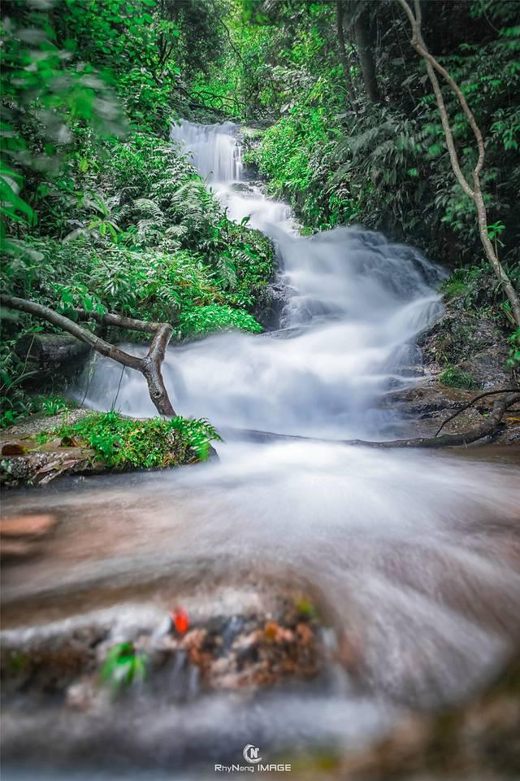

# 天井山国家森林公园

## 景点图片

> 图片来源：[去哪儿旅行](https://tr-osdcp.qunarzz.com/tr-osd-tr-space/img/f38c915b437f1f8c7edf4d8cc1006ed6.jpg_r_640x960x70_9ab0a7c7.jpg)

## 景点特点

- **国家森林公园**：国家级森林公园，自然生态保护良好
- **云海日出**：山顶常年云雾缭绕，云海日出景观壮丽
- **杜鹃花海**：春季杜鹃花盛放，漫山遍野绚丽多彩
- **原始森林**：拥有大面积原始森林，动植物资源丰富
- **高山草甸**：主峰海拔1693米，高山草甸风光独特

## 位置

- **地址**：韶关市乳源瑶族自治县洛阳镇天井山
- **经纬度**：24.6518°N, 112.9708°E

## 交通

- **高铁/火车**：韶关站乘坐至乳源班车，转乘至洛阳镇班车
- **公交**：乳源县城乘坐公交至洛阳镇
- **自驾**：乐广高速乳源出口，按指示牌行驶

## 数据来源

- [百度百科-天井山国家森林公园](https://baike.baidu.com/item/天井山国家森林公园)

## 最后更新时间

2026-07-19
