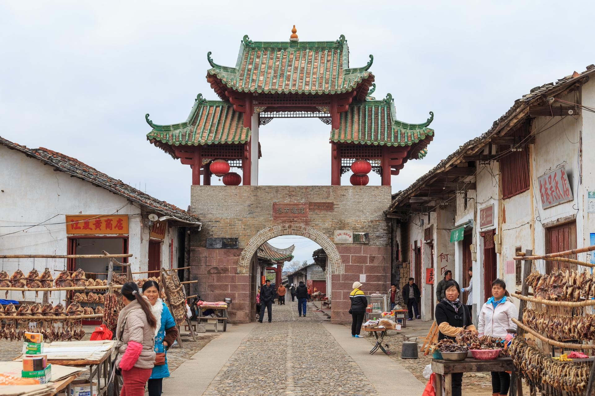

# 珠玑古巷

## 景点图片

> 图片来源：[Wikimedia Commons](https://commons.wikimedia.org/wiki/File:Nanxiong_Zhuji_2014.01.12_10-28-38.jpg) · 许可证：CC BY-SA 4.0

## 基本信息

| 项目 | 内容 |
|------|------|
| 景点名称 | 珠玑古巷 |
| 所在城市 | 韶关市 |
| 所在区县 | 南雄市 |
| 景点级别 | 广东省重点文物保护单位 |
| 景点类型 | 历史古巷/古村落 |
| 开放时间 | 08:30-17:30 |
| 门票价格 | 约40元 |

## 景点介绍

珠玑古巷位于广东省韶关市南雄市珠玑镇，是珠江三角洲广府人的祖居地，被誉为"广府人的故乡"。古巷全长约1500米，宽约3-4米，用鹅卵石铺成，两旁店铺林立，保存有大量明清时期的古建筑。

珠玑古巷是古代中原与岭南交通的重要驿站，也是南雄通往广州的必经之路。历史上，大批中原汉族人为躲避战乱经珠玑古巷南迁至珠三角地区，因此珠玑古巷被海内外广府人视为"祖居地"，每年都有大量海外华侨前来寻根问祖。

## 景点特点

- **广府祖居地**：是珠江三角洲广府人的发源地，被誉为"广府人的故乡"
- **千年古巷**：始建于唐代，至今已有1000多年的历史
- **古建筑群**：保存有大量明清时期的祠堂、民居、店铺等古建筑
- **宗祠文化**：巷内分布着众多姓氏宗祠，记录了南迁移民的历史
- **移民文化**：是研究中原汉族南迁历史和广府文化形成的重要遗址
- **寻根圣地**：每年吸引大量海外华侨前来寻根问祖

## 位置

- **地址**：广东省韶关市南雄市珠玑镇珠玑古巷
- **经纬度**：25.1877°N, 114.3634°E

## 交通

- **高铁**：韶关站乘坐高铁至南雄站，再转乘当地交通
- **公交**：南雄市区有班车直达珠玑古巷
- **自驾**：韶赣高速南雄出口下，沿S342省道行驶至珠玑镇

## 数据来源

- [珠玑古巷景区信息](http://www.nanxiong.gov.cn/)

## 最后更新时间

2026-06-20
